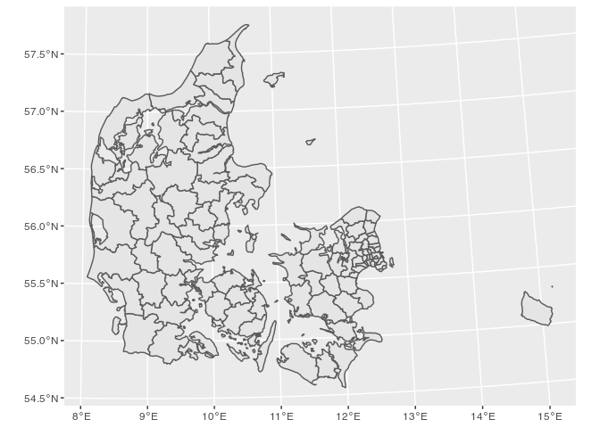
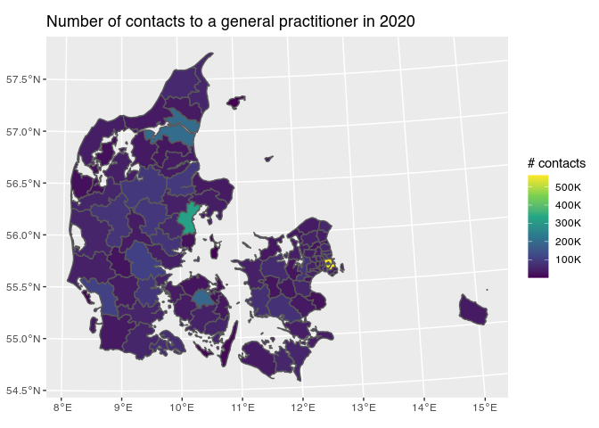

Visualizing data on a map with {ggplot2} and {sf}
================
Johannes Enevoldsen
6/25/2021

> This document generated is from `README.rmd`

This vignette demonstrates how to draw maps of different administrative
divisions of Denmark (municipalities and regions), and how to decorate
the map with geographically anchored data.

The shapefile used is *Danmarks Administrative Geografiske Inddeling 1:2
mio* downloaded from [Styrelsen for Dataforsyning og
Effektivisering](kortforsyningen.dk). This data can be used and
redistributed according to [terms and
conditions](https://download.kortforsyningen.dk/content/vilk%C3%A5r-og-betingelser).

We will use the package [{sf}](https://r-spatial.github.io/sf/) to
handle the geospatial data and
[{ggplot2}](https://ggplot2.tidyverse.org/) to draw it.

``` r
library(tidyverse)
library(sf)
```

First, load the municipality (“KOMMUNE”) layer from the shapefile.

``` r
sf_municipality <- read_sf("SHAPEFILE-DK/", layer = "KOMMUNE")
```

This returns a data frame (tibble) with some metadata. Here, we are
mainly interested in the columns `KOMNAVN` (name of municipality) and
`geometry`.

Let’s draw.

``` r
ggplot(sf_municipality) + 
    geom_sf() + # geom_sf uses the aesthetic geometry instead of x and y. 
    # By default it will assume it is stored in the column geometry.
    coord_sf()
```

<!-- -->

Adding data is just as simple. To demonstrate, we will color each
municipality according to the total number of contacts to a general
practitioner (data from [Danmarks Statistik](dst.dk)).

``` r
gp_contacts <- read_csv("gp-contacts-2020.csv", 
                        col_names = c("Kommune", "n_contacts"),
                        locale = locale(encoding = "latin1"))

knitr::kable(head(gp_contacts))
```

| Kommune       | n\_contacts |
|:--------------|------------:|
| København     |      563169 |
| Frederiksberg |       95378 |
| Dragør        |       13270 |
| Tårnby        |       39388 |
| Albertslund   |       25273 |
| Ballerup      |       44721 |

Now we join the data and the shapes. First, we should check that the
same municipalities are present in both data frames (and that they are
spelled the same way).

``` r
c(
"sf - gp" = setdiff(sf_municipality$KOMNAVN, gp_contacts$Kommune),
"gp - sf" = setdiff(gp_contacts$Kommune, sf_municipality$KOMNAVN)
)
```

    ##       sf - gp 
    ## "Christiansø"

Oh well… [Christiansø](https://da.wikipedia.org/wiki/Christians%C3%B8)
is a small island northeast of Bornholm. It has 90 inhabitants, it is
not really a municipality, and not part of another municipality. It’s
administered by the Departement of Defense. We can probably safely
ignore this.

Join the GP data to the sf data. The order is important (sf data first),
since the returned variable `gp_contacts_w_sf` must be of class “sf”
(with the respective metadata) for `geom_sf()` and `coord_sf()` to do
its magic 🪄

``` r
gp_contacts_w_sf <- left_join(sf_municipality, gp_contacts, by = c("KOMNAVN" = "Kommune"))

ggplot(gp_contacts_w_sf, aes(fill = n_contacts)) + 
    geom_sf(aes(fill = n_contacts)) +
    coord_sf() +
    scale_fill_viridis_c(label = scales::label_number_si()) + 
    labs(title = "Number of contacts to a general practitioner in 2020",
         fill = "# contacts")
```

<!-- -->
