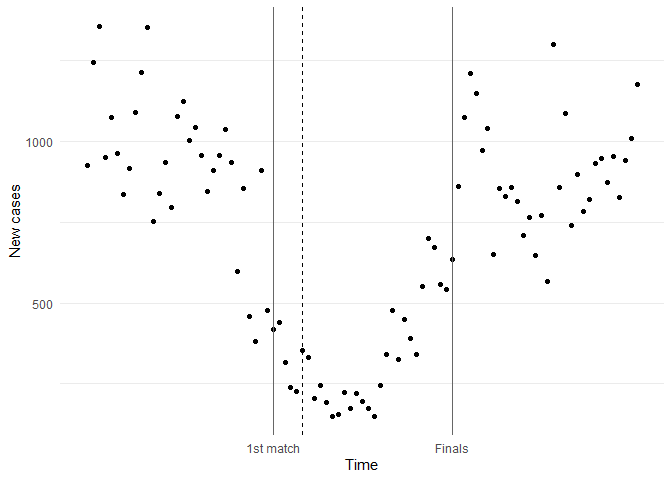
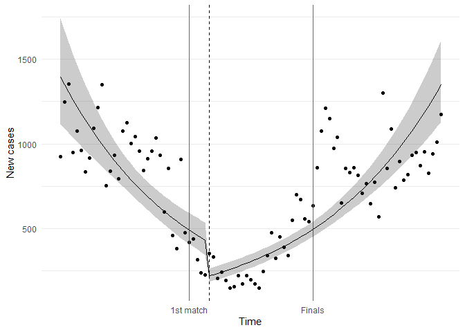
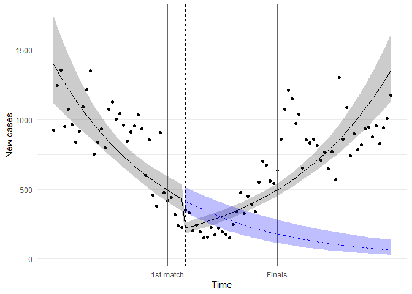

In this example, we will perform a very simple interrupted time series
analysis, with the number of daily new cases in Denmark as the dependent
variable and the intervention of interest being the beginning of the
European Football Championship 2020.

First, we load the libraries and relevant data (daily cases) from “Our
World in Data”.

    library("data.table")
    library("ggplot2")

    cases <- fread("https://github.com/owid/covid-19-data/raw/master/public/data/jhu/new_cases.csv")
    setnames(cases, tolower)
    den <- cases[between(date, as.Date("2021-05-11"), as.Date("2021-08-11")), 
                   .(date, denmark)]
    den <- melt(den, "date", variable.name = "country", value.name = "newcases")
    den[1:10]

    ##           date country newcases
    ##  1: 2021-05-11 denmark      926
    ##  2: 2021-05-12 denmark     1246
    ##  3: 2021-05-13 denmark     1355
    ##  4: 2021-05-14 denmark      951
    ##  5: 2021-05-15 denmark     1075
    ##  6: 2021-05-16 denmark      964
    ##  7: 2021-05-17 denmark      836
    ##  8: 2021-05-18 denmark      916
    ##  9: 2021-05-19 denmark     1091
    ## 10: 2021-05-20 denmark     1214

Specify the expected lag for the intervention to have effect on the
number of cases, here I chose the median incubation period for a
SARS-CoV-2 infection. Lag should be longer if the outcome of death is
hospitalization or mortality.

    lag <- 5

Now we generate the variables needed to fit a segmented regression model
(t = days since observation start, euro = binary indicator for pre-/post
period, tpost = days since start of Euro 2020)

    den[, t := as.numeric(date - min(date))]

    # Indicator for pre-/post-intervention periods
    den[, euro := 1 * (date >= as.Date("2021-06-11") + lag)]

    # Time since intervention takes effect
    euro_day1 <- den[euro == 1, min(date)]
    den[, tpost := pmax(0, date - euro_day1)]

Let us start with having a look at the time series data. The black lines
represent the start and end of the European championship, the dashed
line indicates when we expect the effect of the intervention to start to
kick in.

    eurodur <- as.IDate(c("2021-06-11", "2021-07-11")) - min(den$date)

    # Plot time series
    ts <- ggplot(den, aes(x = t, y = newcases)) +
      geom_point() +
      geom_vline(xintercept = eurodur,
                 color = "grey40") +
      geom_vline(xintercept = euro_day1 - min(den$date), lty = 2) +
      scale_x_continuous(breaks = eurodur,
                         labels = c("1st match", "Finals")) +
      xlab("Time") +
      ylab("New cases") +
      theme_minimal() +
      theme(panel.grid.major.x = element_blank(),
            panel.grid.minor.x = element_blank()) 
    ts

Now, we fit a segmented regression model. We use a log-transformed
dependent variable, as one could expect a better fit in the case of an
increasing incidence.

    logfit <- lm(log(newcases) ~ t + euro + tpost, data = den)

We will not interpret regression coefficients for now and just focus on
the visualization of the model. We need to obtain the predicted values
first (with 95% confidence intervals)

    logpred <- predict(logfit, newdata = den, interval = "confidence")
    den[, pred := exp(logpred[,1])]
    den[, lb := exp(logpred[,2])]
    den[, ub := exp(logpred[,3])]

Alright, let’s look at the model:

    its <- 
      ts + 
      geom_ribbon(aes(ymin = lb, ymax = ub), alpha = 0.25) +
      geom_line(aes(y = pred))
    its

 A bit
crude, but somewhat acceptable for now. Now we just need to predict the
counterfactual (i.e. the expected number of daily cases had Denmark not
participated in the Euro 2020, shown as the blue line)

    prefit <- lm(log(newcases) ~ t, data = den[euro == 0])
    prepred <- predict(prefit, newdata = den[euro == 1], interval = "confidence")  
    den[euro == 1, pre   := exp(prepred[,1])]
    den[euro == 1, prelb := exp(prepred[,2])]
    den[euro == 1, preub := exp(prepred[,3])]

    its + 
      geom_line(aes(y = pre), lty = 2, color = "blue") +
      geom_ribbon(aes(ymin = prelb, ymax = preub), alpha = 0.25, fill = "blue")

    ## Warning: Removed 36 row(s) containing missing values (geom_path).

From here, you could:  
\* obtain regression coefficients quantifying the change in trend
(tpost) or obtain the estimated difference between the observed and
counterfactual model at a given time after the intervention.  
\* model the lag period as a separate period, which may result in a
better model fit, or experiment with varying lag periods.  
\* experiment with different distributions (Poisson) or biologically
more plausible link functions, e.g. accounting for a depletion of
individuals who can be infected.  
\* add more (relevant) interventions (e.g. reaching the quarterfinal),
or add control series (other countries) and use these as the
counterfactual instead.  
\* quantify the effect on hospitalization or mortality due to SARS-CoV-2
infection instead of the number of cases.

We may try and explore some of these during the COVID-19 datathon
weekend.
