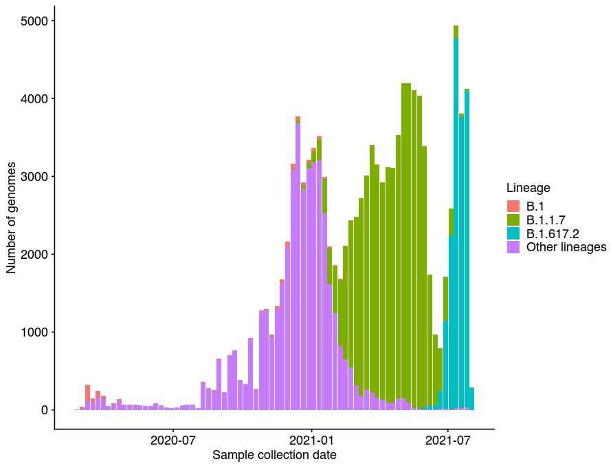
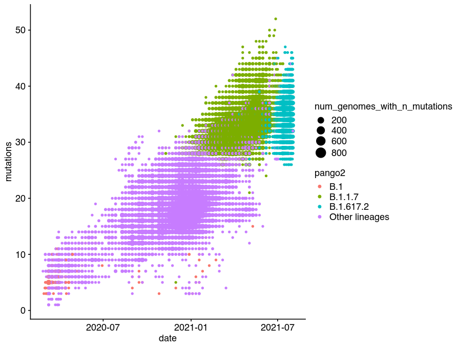
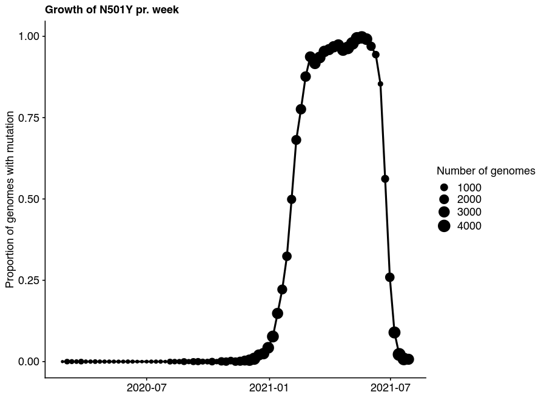
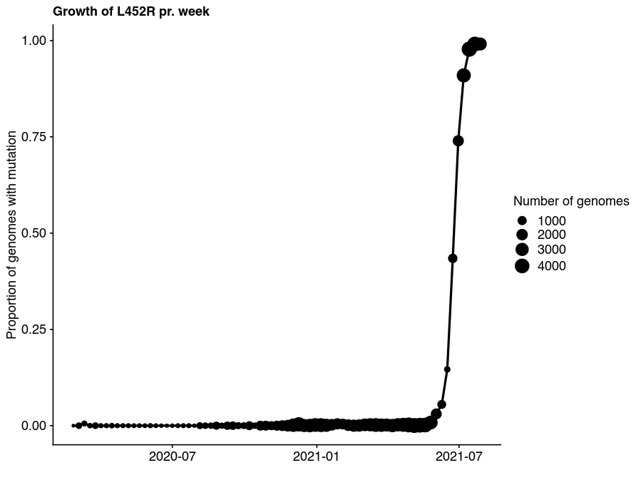
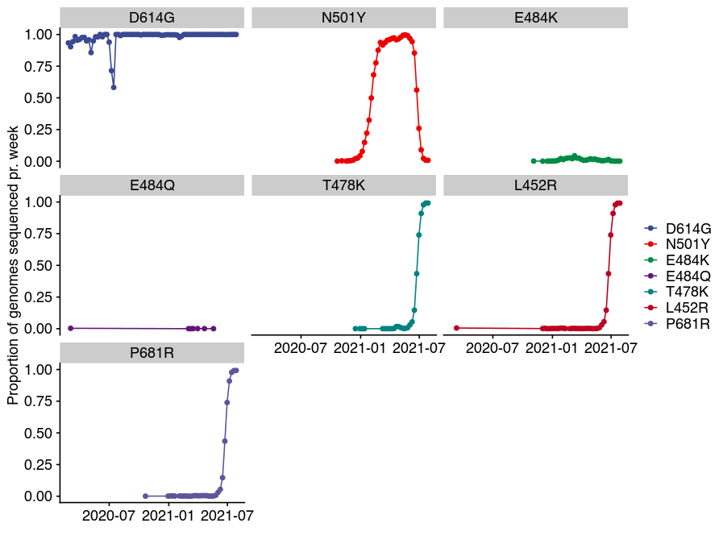

Working with data from GISaid mutation pipeline (snpeff annotated
mutations)
================
Palle Villesen
Last update: 2021-08-19 11:22:19

# Init

``` r
library(tidyverse)
library(cowplot)  # For theme
library(lubridate)
library(ggsci)
library(ggrepel)

text_base_size   <- 12
fig.witdh        <- 210
fig.height       <- 160

ggplot_text_size <- text_base_size / ggplot2::.pt
# Now use: geom_text(..., size = ggplot_text_size)
theme_set(theme_cowplot(font_size = text_base_size, 
                        rel_small = 1, rel_tiny = 1, 
                        rel_large = 1))

knitr::opts_chunk$set(fig.width = fig.witdh/25.4,
                      fig.height = fig.height/25.4,
                      dpi = 108,
                      fig.path = "figs/",
                      message = FALSE,
                      warning = FALSE)

x <- Sys.setlocale(locale = "en_GB.utf8")
rm(x)
```

# Load data

Data is generated from [GISAID](https://www.gisaid.org/) and will be
provided at the event.

``` r
mutations <- read_tsv(file = "mutations_snpeff_annotated_tidy_Denmark.tsv")
metadata  <- read_tsv(file = "metadata_snpeff_tidy_Denmark.tsv")

# List of pangolin lineages to include in the analysis
interesting_lineages <- c("B.1",   # The D614G mutation defines this lineage back in early 2020
                       "B.1.1.7",  # British  = ALFA
                       "B.1.617.2" # Indian variant = DELTA
                       )

# Mutations to track
interesting_mutations <- c("D614G", "N501Y", "E484K", "E484Q", "T478K","L452R", "P681R") 
```

# Data structure for metadata

``` r
x <- head(mutations, n = 1) %>% t()

tibble(variable = rownames(x), value=x[,1]) %>% knitr::kable()
```

| variable      | value               |
|:--------------|:--------------------|
| id            | 1022420             |
| CHROM         | NC\_045512          |
| position      | 913                 |
| ref\_base     | C                   |
| variant\_base | T                   |
| gene          | ORF1ab\_pp1a        |
| biotype       | protein\_coding     |
| impact        | LOW                 |
| effect        | synonymous\_variant |
| hgvs\_c       | c.648C&gt;T         |
| hgvs\_p       | p.Ser216Ser         |
| aa\_position  | 216                 |
| type          | S                   |
| aa\_change    | S216S               |

``` r
rm(x)

head(mutations, n=5) %>% knitr::kable()
```

|      id | CHROM      | position | ref\_base | variant\_base | gene          | biotype         | impact   | effect              | hgvs\_c      | hgvs\_p      | aa\_position | type | aa\_change |
|--------:|:-----------|---------:|:----------|:--------------|:--------------|:----------------|:---------|:--------------------|:-------------|:-------------|-------------:|:-----|:-----------|
| 1022420 | NC\_045512 |      913 | C         | T             | ORF1ab\_pp1a  | protein\_coding | LOW      | synonymous\_variant | c.648C&gt;T  | p.Ser216Ser  |          216 | S    | S216S      |
| 1022420 | NC\_045512 |      913 | C         | T             | ORF1ab\_pp1ab | protein\_coding | LOW      | synonymous\_variant | c.648C&gt;T  | p.Ser216Ser  |          216 | S    | S216S      |
| 1022420 | NC\_045512 |     3037 | C         | T             | ORF1ab\_pp1a  | protein\_coding | LOW      | synonymous\_variant | c.2772C&gt;T | p.Phe924Phe  |          924 | S    | F924F      |
| 1022420 | NC\_045512 |     3037 | C         | T             | ORF1ab\_pp1ab | protein\_coding | LOW      | synonymous\_variant | c.2772C&gt;T | p.Phe924Phe  |          924 | S    | F924F      |
| 1022420 | NC\_045512 |     3267 | C         | T             | ORF1ab\_pp1a  | protein\_coding | MODERATE | missense\_variant   | c.3002C&gt;T | p.Thr1001Ile |         1001 | N    | T1001I     |

# Data structure for mutations

``` r
x <- head(metadata, n = 1) %>% t()

tibble(variable = rownames(x), value=x[,1]) %>% knitr::kable()
```

| variable                        | value                                       |
|:--------------------------------|:--------------------------------------------|
| id                              | 415647                                      |
| Virus name                      | hCoV-19/Denmark/SSI-102/2020                |
| Type                            | betacoronavirus                             |
| Accession ID                    | EPI\_ISL\_415647                            |
| Collection date                 | 2020-03-03                                  |
| Location                        | Europe / Denmark / Hovedstaden / Copenhagen |
| region                          | Europe                                      |
| country                         | Denmark                                     |
| division                        | Hovedstaden                                 |
| Additional location information | NA                                          |
| Sequence length                 | 29958                                       |
| Host                            | Human                                       |
| Patient age                     | 31                                          |
| Gender                          | Male                                        |
| Clade                           | G                                           |
| pangolin\_lineage               | B.1                                         |
| Pangolin version                | 2021-07-28                                  |
| Variant                         | NA                                          |
| AA Substitutions                | (Spike\_L611F,NSP12\_P323L,Spike\_D614G)    |
| date\_submitted                 | 2020-03-18                                  |
| Is reference?                   | NA                                          |
| Is complete?                    | TRUE                                        |
| Is high coverage?               | TRUE                                        |
| Is low coverage?                | NA                                          |
| N-Content                       | 0.003371499                                 |
| GC-Content                      | 0.3809285                                   |
| species                         | Human                                       |
| date                            | 2020-03-03                                  |
| Patient status                  | NA                                          |
| Passage                         | NA                                          |
| Specimen                        | NA                                          |
| Additional host information     | NA                                          |
| Lineage                         | NA                                          |
| Sampling strategy               | NA                                          |
| Last vaccinated                 | NA                                          |
| count\_N                        | 3                                           |
| count\_S                        | 1                                           |

``` r
rm(x)

head(metadata, n=5) %>% knitr::kable()
```

|     id | Virus name                     | Type            | Accession ID     | Collection date | Location                                    | region | country | division    | Additional location information | Sequence length | Host  | Patient age | Gender  | Clade | pangolin\_lineage | Pangolin version | Variant | AA Substitutions                                                          | date\_submitted | Is reference? | Is complete? | Is high coverage? | Is low coverage? | N-Content | GC-Content | species | date       | Patient status | Passage | Specimen | Additional host information | Lineage | Sampling strategy | Last vaccinated | count\_N | count\_S |
|-------:|:-------------------------------|:----------------|:-----------------|:----------------|:--------------------------------------------|:-------|:--------|:------------|:--------------------------------|----------------:|:------|:------------|:--------|:------|:------------------|:-----------------|:--------|:--------------------------------------------------------------------------|:----------------|:--------------|:-------------|:------------------|:-----------------|----------:|-----------:|:--------|:-----------|:---------------|:--------|:---------|:----------------------------|:--------|:------------------|:----------------|---------:|---------:|
| 415647 | hCoV-19/Denmark/SSI-102/2020   | betacoronavirus | EPI\_ISL\_415647 | 2020-03-03      | Europe / Denmark / Hovedstaden / Copenhagen | Europe | Denmark | Hovedstaden | NA                              |           29958 | Human | 31          | Male    | G     | B.1               | 2021-07-28       | NA      | (Spike\_L611F,NSP12\_P323L,Spike\_D614G)                                  | 2020-03-18      | NA            | TRUE         | TRUE              | NA               | 0.0033715 |  0.3809285 | Human   | 2020-03-03 | NA             | NA      | NA       | NA                          | NA      | NA                | NA              |        3 |        1 |
| 415646 | hCoV-19/Denmark/SSI-101/2020   | betacoronavirus | EPI\_ISL\_415646 | 2020-03-03      | Europe / Denmark                            | Europe | Denmark | NA          | NA                              |           29896 | Human | 31          | Male    | G     | B.1               | 2021-07-28       | NA      | (NSP12\_P323L,Spike\_D614G,Spike\_Q675H)                                  | 2020-03-18      | NA            | TRUE         | TRUE              | NA               |        NA |  0.3800843 | Human   | 2020-03-03 | NA             | NA      | NA       | NA                          | NA      | NA                | NA              |        3 |        2 |
| 415648 | hCoV-19/Denmark/SSI-104/2020   | betacoronavirus | EPI\_ISL\_415648 | 2020-03-03      | Europe / Denmark                            | Europe | Denmark | NA          | NA                              |           29845 | Human | unknown     | Male    | GH    | B.1.428           | 2021-07-28       | NA      | (NSP14\_T206I,NSP2\_T166I,NS3\_Q57H,NSP2\_T85I,NSP12\_P323L,Spike\_D614G) | 2020-03-18      | NA            | TRUE         | TRUE              | NA               |        NA |  0.3799631 | Human   | 2020-03-03 | NA             | NA      | NA       | NA                          | NA      | NA                | NA              |        6 |        1 |
| 429262 | hCoV-19/Denmark/ALAB-HH01/2020 | betacoronavirus | EPI\_ISL\_429262 | 2020-03-10      | Europe / Denmark                            | Europe | Denmark | NA          | NA                              |           29782 | Human | unknown     | unknown | GH    | B.1               | 2021-07-28       | NA      | (NSP3\_N1369T,NS3\_Q57H,NSP2\_T85I,NSP1\_S166G,NSP12\_P323L,Spike\_D614G) | 2020-04-23      | NA            | TRUE         | TRUE              | NA               |        NA |  0.3801289 | Human   | 2020-03-10 | NA             | NA      | NA       | NA                          | NA      | NA                | NA              |        6 |        1 |
| 429264 | hCoV-19/Denmark/ALAB-HH03/2020 | betacoronavirus | EPI\_ISL\_429264 | 2020-03-10      | Europe / Denmark                            | Europe | Denmark | NA          | NA                              |           29782 | Human | unknown     | unknown | GH    | B.1               | 2021-07-28       | NA      | (NS3\_Q57H,NSP2\_T85I,NSP12\_P323L,Spike\_D614G)                          | 2020-04-23      | NA            | TRUE         | TRUE              | NA               |        NA |  0.3800618 | Human   | 2020-03-10 | NA             | NA      | NA       | NA                          | NA      | NA                | NA              |        4 |        1 |

# Overview of data

``` r
pd <- tibble() %>%
  bind_rows(tibble("Description" = "Genomes total (metadata)", 
                   "n" = metadata %>% select(id) %>% distinct() %>% count() %>% pull(n) )) %>%
  bind_rows(tibble("Description" = "Genomes with mutations (mutations)", 
                   "n" = mutations %>% select(id) %>% distinct() %>% count() %>% pull(n) )) %>%
  bind_rows(tibble("Description" = "Mutations in these genomes", 
                   "n" = mutations %>% distinct(id, position) %>% count() %>% pull(n))) %>%
  bind_rows(tibble("Description" = "Sites with Synonymous mutations",
                   "n" = mutations %>% filter(type=="S") %>% select(position) %>% distinct() %>% count() %>% pull(n) )) %>%
  bind_rows(tibble("Description" = "Sites with Nonsynonymous mutations",
                   "n" = mutations %>% filter(type=="N") %>% select(position) %>% distinct() %>% count() %>% pull(n) )) %>%
  {.}

knitr::kable(pd)
```

| Description                        |       n |
|:-----------------------------------|--------:|
| Genomes total (metadata)           |  117733 |
| Genomes with mutations (mutations) |  117594 |
| Mutations in these genomes         | 3235960 |
| Sites with Synonymous mutations    |    5488 |
| Sites with Nonsynonymous mutations |    8705 |

# Examples

## Genomes sampled pr. week

``` r
pd <- metadata %>%
  filter(species=="Human") %>%
  mutate(date_bin = cut(date, breaks = "1 week")) %>%
  mutate(pango2 = ifelse(pangolin_lineage %in% interesting_lineages, pangolin_lineage, "Other lineages")) %>%
  group_by(date_bin, pango2) %>%
  count()

newlevels <- sort(levels(pd$date_bin))

pd <- pd %>% 
  mutate(date_bin = fct_relevel(date_bin, newlevels)) %>% 
  ungroup() %>%
  mutate(date_bin=ymd(date_bin))

ggplot(pd, aes(x=date_bin, y=n, fill=pango2)) + 
  geom_col() +
  scale_fill_discrete("Lineage") +
  xlab("Sample collection date") +
  ylab("Number of genomes") +
  NULL
```

<!-- -->

## Mutational clock

``` r
# Get mutations pr genome
tmp <- mutations %>% 
  group_by(id) %>% 
  distinct(position) %>%
  summarise(mutations = n())

# Merge with metadata to get the date and lineage
pd <- metadata %>% 
  left_join(tmp) %>%
  filter(species=="Human") %>%
  mutate(pango2 = ifelse(pangolin_lineage %in% interesting_lineages,
                         pangolin_lineage, "Other lineages")) %>%
  select(id, mutations,everything()) %>%
  group_by(date,mutations,pango2) %>%
  summarise(num_genomes_with_n_mutations = n()) 

ggplot(pd, aes(x=date, y=mutations, color=pango2, size=num_genomes_with_n_mutations)) +
  geom_point() + 
  NULL
```

<!-- -->

``` r
metadata %>% 
  left_join(tmp) %>%
  filter(species=="Human") %>% filter(mutations==0)
```

    ## # A tibble: 0 × 38
    ## # … with 38 variables: id <dbl>, Virus name <chr>, Type <chr>,
    ## #   Accession ID <chr>, Collection date <date>, Location <chr>, region <chr>,
    ## #   country <chr>, division <chr>, Additional location information <lgl>,
    ## #   Sequence length <dbl>, Host <chr>, Patient age <chr>, Gender <chr>,
    ## #   Clade <chr>, pangolin_lineage <chr>, Pangolin version <date>,
    ## #   Variant <lgl>, AA Substitutions <chr>, date_submitted <date>,
    ## #   Is reference? <lgl>, Is complete? <lgl>, Is high coverage? <lgl>, …

## Rise and fall of the N501Y mutation in Denmark

``` r
tmp1 <- mutations %>%
  filter(gene=="S" & aa_change=="N501Y")

pd <- metadata %>%
  filter(species=="Human") %>%
  mutate(mutation = ifelse(id %in% tmp1$id, "mutated", "Other")) %>%
  mutate(date_bin = cut(date, breaks = "7 days")) %>%
  group_by(date_bin, country) %>%
  count(mutation)

newlevels <- sort(levels(pd$date_bin))

pd <- pd %>% 
  mutate(date_bin = fct_relevel(date_bin, newlevels)) %>% 
  ungroup() %>%
  mutate(date_bin=ymd(date_bin)) %>%
  pivot_wider(names_from = mutation, values_from=n, values_fill =0) %>%
  {.}

ggplot(pd, aes(x=date_bin, y=mutated/(mutated+Other), 
               size=mutated+Other) ) + 
  geom_point() +
  geom_line(size=1) +
  xlab("") +
  ylab("Proportion of genomes with mutation") +
  scale_size("Number of genomes") +
  ggsci::scale_color_aaas(name="") +
  ggtitle("Growth of N501Y pr. week") +
  NULL
```

<!-- -->

## Rise of the spike L452R variant in Denmark

``` r
tmp1 <- mutations %>%
  filter(gene=="S" & aa_change=="L452R")

pd <- metadata %>%
  filter(species=="Human") %>%
  mutate(mutation = ifelse(id %in% tmp1$id, "mutated", "Other")) %>%
  mutate(date_bin = cut(date, breaks = "7 days")) %>%
  group_by(date_bin, country) %>%
  count(mutation)

newlevels <- sort(levels(pd$date_bin))

pd <- pd %>% 
  mutate(date_bin = fct_relevel(date_bin, newlevels)) %>% 
  ungroup() %>%
  mutate(date_bin=ymd(date_bin)) %>%
  pivot_wider(names_from = mutation, values_from=n, values_fill =0) %>%
  {.}

ggplot(pd, aes(x=date_bin, y=mutated/(mutated+Other), 
               size=mutated+Other) ) + 
  geom_point() +
  geom_line(size=1) +
  xlab("") +
  ylab("Proportion of genomes with mutation") +
  scale_size("Number of genomes") +
  ggsci::scale_color_aaas(name="") +
  ggtitle("Growth of L452R pr. week") +
  NULL
```

<!-- -->

## History of interesting mutations

``` r
tmp1 <- mutations %>%
  filter(gene=="S" & aa_change %in% interesting_mutations)

pd <- metadata %>%
  filter(species=="Human") %>%
  left_join(tmp1) %>%
  mutate(date_bin = cut(date, breaks = "7 days")) %>%
  group_by(date_bin) %>%
  count(aa_change)

pd2 <- metadata %>%
  filter(species=="Human") %>%
  mutate(date_bin = cut(date, breaks = "7 days")) %>%
  group_by(date_bin) %>%
  count() %>%
  rename(total_genomes=n)

pd <- pd %>% 
  ungroup() %>%
  group_by(date_bin) %>%
  mutate(aa_change = factor(aa_change, levels = c(interesting_mutations, "Other"))) %>%
  left_join(pd2) %>%
  filter(!is.na(aa_change)) %>%
  {.}

pd <- pd %>% mutate(date_bin = ymd(date_bin)) %>% arrange(desc(date_bin))

ggplot(pd, aes(x=date_bin, y=n/total_genomes, color=aa_change)) + 
  geom_point() +
  geom_line() +
  xlab("") +
  ylab("Proportion of genomes sequenced pr. week") +
  ggsci::scale_color_aaas(name="") +
  facet_wrap(~aa_change) +
  NULL
```

<!-- -->
