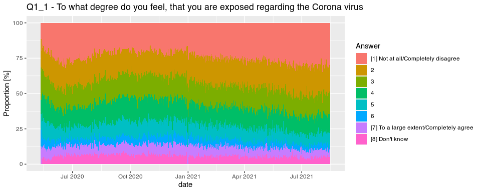

HOPE questionaire
================
Johannes Enevoldsen

> This document is generated from [README.rmd](README.rmd)

Answers from the daily questionnaires from the [HOPE
project](https://hope-project.dk/#/) will be available during the
datathon. The data is aggregated to daily counts for each answers for
each question. The data is provided as a .dta (STATA) file and can be
read using the [{haven}](https://haven.tidyverse.org/) package.

> :bulb: NB. The HOPE project team is still in the process of analysing
> and publishing their data. We therefore ask that you invite the HOPE
> team as collaborators if you wish to publish results based on this
> dataset. This is both to ensure scientific quality (the team has
> expertise and access to the uncensored dataset), and to ensure the
> HOPE team is not “scooped” because of kindly making their data
> available for this event.

The questions participants have been asked (translated to English) can
be found in the [codebook](./questions.md).

First, we load packages

``` r
library(tidyverse)
library(haven) # Used to read STATA files
```

Then, we load data

``` r
attitudes <- read_dta("distributions_attitudes.dta")
head(attitudes)
```

    ## # A tibble: 6 × 50
    ##   date       category  attitude_labels  Q1_1  Q1_2  Q2_1  Q2_2  Q2_3  Q2_4  Q2_5
    ##   <date>        <dbl>        <dbl+lbl> <dbl> <dbl> <dbl> <dbl> <dbl> <dbl> <dbl>
    ## 1 2020-05-12        1 1 [Not at all/C…     9     0     0     0     0     0     6
    ## 2 2020-05-12        2 2                   16     6     0     0     0     0     6
    ## 3 2020-05-12        3 3                   18     7     0     0     0     0     7
    ## 4 2020-05-12        4 4                    8    18     9     5     8     0    25
    ## 5 2020-05-12        5 5                    9    19     5     6    12     0    15
    ## 6 2020-05-12        6 6                    9     6    25    16    20    22    11
    ## # … with 40 more variables: Q2_6 <dbl>, Q3_1 <dbl>, Q3_2 <dbl>, Q3_3 <dbl>,
    ## #   Q3_4 <dbl>, Q3_5 <dbl>, Q3_6 <dbl>, Q3_7 <dbl>, Q5_1 <dbl>, Q5_2 <dbl>,
    ## #   Q5_3 <dbl>, Q5_4 <dbl>, Q5_5 <dbl>, Q6_1 <dbl>, Q6_2 <dbl>, Q6_3 <dbl>,
    ## #   Q6_4 <dbl>, Q6_5 <dbl>, Q6_6 <dbl>, Q6_7 <dbl>, Q6_8 <dbl>, Q6_9 <dbl>,
    ## #   mask_labels <dbl+lbl>, mask <dbl>, symptoms_labels <dbl+lbl>, Q7_1 <dbl>,
    ## #   Q7_2 <dbl>, Q7_3 <dbl>, Q7_4 <dbl>, Q7_5 <dbl>, infected_labels <dbl+lbl>,
    ## #   contact_w_infected <dbl>, test_labels <dbl+lbl>, test <dbl>, …

> Censoring :black\_large\_square: : For privacy reasons, any count
> below 5 is replaced with 0. For statistical analysis it could be
> sensible to replace this with a reasonable mean for these responses
> (e.g. 2). In this example we will just treat it as 0.

Questions regarding number of recent contacts have many possible answers
are therefore provided in a separate file.

``` r
contacts <- read_dta("distributions_contacts.dta") %>% 
    mutate(across(starts_with("Q"), replace_na, 0), # In the contacts file, NA represents < 5 responses
           contacts = ifelse(contacts == 999, 25, contacts)) # 999 represents >20 contacts. In this example we treat this as 25 contacts.
head(contacts)
```

    ## # A tibble: 6 × 10
    ##   date       contacts Q4a_1 Q4a_2 Q4a_3 Q4a_4 Q4b_1 Q4b_2 Q4b_3 Q4b_4
    ##   <date>        <dbl> <dbl> <dbl> <dbl> <dbl> <dbl> <dbl> <dbl> <dbl>
    ## 1 2020-05-12        0    51    67    52    58    60    70    69    66
    ## 2 2020-05-12        1     9     0    10     5     7     0     0     0
    ## 3 2020-05-12        2     9     0     7     0     5     0     0     0
    ## 4 2020-05-12        3     5     0     0     0     5     0     0     5
    ## 5 2020-05-12        4     0     0     5     0     0     0     0     0
    ## 6 2020-05-12        5     0     0     0     0     0     0     0     0

## The structure

-   Date is the date of the answers.
-   Columns ending with `_labels` are labelled categorical values
    (similar to factors) corresponding to each possible answer to a
    question.
-   Remaining columns (e.g. Q1\_1) counts the number of participants who
    have given a specific answer (corresponding the to `_labels` column
    left of it) on a given date.

## Label columns

The labelled columns can be converted to a factor with
`haven::as_factor`.

Here is an example of labels with *labelled* class.

``` r
attitudes$attitude_labels %>% head(10)
```

    ## <labelled<double>[10]>
    ##  [1] 1 2 3 4 5 6 7 8 1 2
    ## 
    ## Labels:
    ##  value                              label
    ##      1     Not at all/Completely disagree
    ##      7 To a large extent/Completely agree
    ##      8                         Don't know

Here they are, converted to a factor

``` r
as_factor(attitudes$attitude_labels, levels = "both") %>% head(10)
```

    ##  [1] [1] Not at all/Completely disagree    
    ##  [2] 2                                     
    ##  [3] 3                                     
    ##  [4] 4                                     
    ##  [5] 5                                     
    ##  [6] 6                                     
    ##  [7] [7] To a large extent/Completely agree
    ##  [8] [8] Don't know                        
    ##  [9] [1] Not at all/Completely disagree    
    ## [10] 2                                     
    ## 8 Levels: [1] Not at all/Completely disagree 2 3 4 5 ... [8] Don't know

For convenience (especially for plots), we make a second version of all
`_labels` columns, converted to a factor:

``` r
attitudes <- attitudes %>% 
    mutate(across(ends_with("_labels"), as_factor, levels = "both", .names = "{.col}_2"))

attitudes$mask_labels_2 %>% head(10)
```

    ##  [1] <NA> <NA> <NA> <NA> <NA> <NA> <NA> <NA> <NA> <NA>
    ## 6 Levels: [1] Have not used facemask [2] 1-3 [3] 4-6 [4] 7-9 ... [6] Don't know

*In the first few months, there was no questions regarding mask usage*

## Calculate proportions

The number of people who answer each day differs, we will therefore
calculate the daily proportion of each answer:

``` r
attitudes_prop <- attitudes %>% 
    group_by(date) %>% 
    mutate(across(c(starts_with("Q"), "mask", "contact_w_infected", "test", "selfisolation", "selfisolation1", "vaccination"), 
                  .fns = ~.x / sum(.x), # Since the data frame has been grouped by day, the sum will be calculated for each day.
                  ))
```

We can illustrate the daily distribution in answers using a stacked bar
plot of the proportions.

``` r
ggplot(attitudes_prop, aes(date, Q1_1 * 100, fill = fct_relevel(attitude_labels_2, "Don't know", after = Inf))) +
    geom_col(position = "stack", width = 1) +
    labs(title = "Q1_1 - To what degree do you feel, that you are exposed regarding the Corona virus",
         fill = "Answer",
         y = "Proportion [%]")
```

<!-- -->
