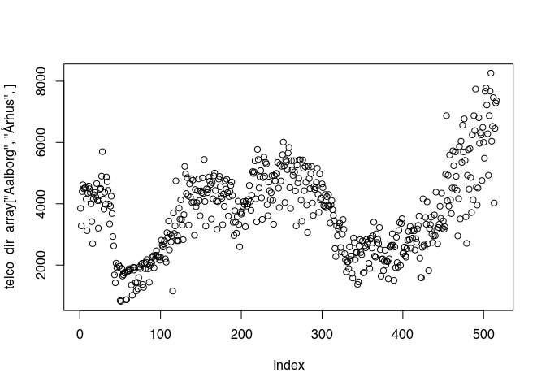
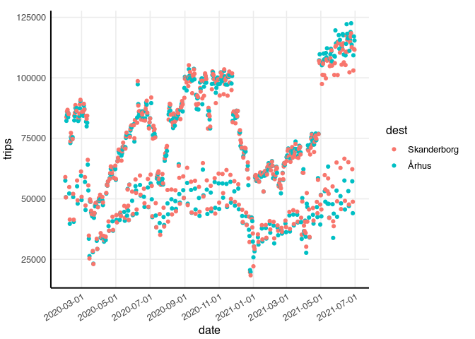
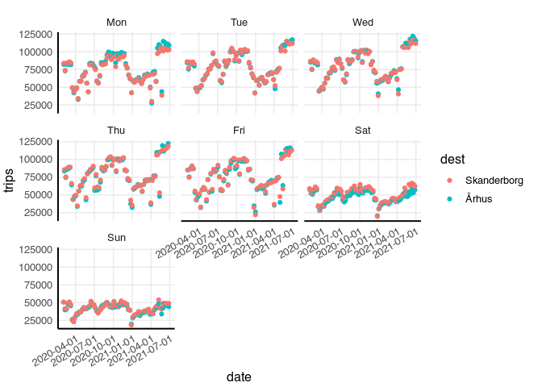

Mobility of mobile phones in Denmark
================
Johannes Enevoldsen

> This document is generated from [README.rmd](README.rmd)

Mobility data based on the movement of mobile phones between telephone
towers in Denmark is available from <https://covid19.compute.dtu.dk/>.
The data is collected and aggregated from different network providers as
described
[here](https://covid19.compute.dtu.dk/data-description/telco_data/).

A data file containing the number of movements between each combination
of municipalities each day can be downloaded from the website:

> In this dataset, directions of travel are unknown. A directional
> dataset is also available. See the bottom of this page.

``` r
telco_link <- "https://covid19.compute.dtu.dk/data/telco_map_new.json"

# The file is large (>17 MB) so only download if missing (or outdated)
if(!file.exists("telco_map_new.json")) {
    download.file(telco_link, destfile = "telco_map_new.json")
}
```

The data is provided as a .json file (a text based data format commonly
used in web applications). We can read it into R as a list using the
{jsonlite} package. We’ll also use {tidyverse}.

``` r
library(jsonlite)
library(tidyverse)

telco_list <- fromJSON("telco_map_new.json") # Load json file

str(telco_list, list.len = 2) # Print structure
```

    ## List of 99
    ##  $ Aabenraa         :List of 99
    ##   ..$ Aabenraa         : int [1:516] 646324 590656 777948 809334 815630 847670 835820 619796 489948 693152 ...
    ##   ..$ _Aabenraa        : int [1:516] 829561 738094 978612 1012792 1022912 1070101 1099371 807903 618653 890815 ...
    ##   .. [list output truncated]
    ##  $ Aalborg          :List of 99
    ##   ..$ Aabenraa         : int [1:483] 591 542 264 200 195 305 505 591 559 294 ...
    ##   ..$ _Aalborg         : int [1:516] 4402576 3958961 5043122 5156144 5211169 5280009 5303239 4306609 3432979 4948039 ...
    ##   .. [list output truncated]
    ##   [list output truncated]

The structure is a list of municipalities, that each contain a list of
municipalities, that each contain a vector of number of daily trips
between the pair of municipalities (the direction is unknown).
`telco_list$Aalborg$Frederikshavn` are trips between Aalborg and
Frederikshavn, `telco_list$Aalborg$Aalborg` are trips within Aalborg,
and `` telco_list$Aalborg$`_Aalborg` `` are all trips involving Aalborg.

First, if the direction is unknown, `telco_list$Aalborg$Frederikshavn`
should be identical to `telco_list$Frederikshavn$Aalborg`

``` r
identical(telco_list$Aalborg$Frederikshavn, telco_list$Frederikshavn$Aalborg)
```

    ## [1] TRUE

We can check that for all combinations:

``` r
municipalities <- names(telco_list[1:98]) # skip $_meta

for(mun1 in municipalities) {
    for(mun2 in municipalities) {
        stopifnot(identical(telco_list[[mun1]][[mun2]], telco_list[[mun2]][[mun1]]))
    } 
}
```

The vector of daily trips (e.g. `telco_list$Aabenraa$Aalborg`)
corresponds to the dates in `` telco_list$`_meta`$datetime ``. I cases
where the vector of daily trips is shorter than the number of days, the
trips correspond to the first dates, and the missing values are zero.

We’ll make these zeros explicit. Also the total entry (`$_municipality`)
is a summary (sum) of the daily trips and can be calculated if needed.
We’ll remove that too.

``` r
telco_list_trips <- telco_list[1:98] # skip the meta item

telco_list_trips <- map(telco_list_trips, function(x) {
    # In each sub-list, remove the list which name starts with "_"
    x[str_detect(names(x), "^_")] <- NULL
    x
    })

telco_dates <- as.Date(telco_list$`_meta`$datetime)

zero_pad_end <- function(vec, total_len) {
    stopifnot(total_len >= length(vec))
    c(vec, rep(0, total_len - length(vec)))
}

telco_list_trips <- rapply(telco_list_trips, zero_pad_end, total_len = length(telco_dates), how = "replace")
```

This data would fit nicely in a 3D array (Municipality1 x Municipality2
x date)… But this is R, so we’ll jam it into a dataframe.

``` r
telco_trips_df <- tibble(municip1 = names(telco_list_trips), 
                         municip2 = telco_list_trips) %>% 
    unnest_longer(municip2, indices_to = "municip2", values_to = "trips") %>% 
    mutate(date = list(telco_dates), .before = "municip1") %>% 
    unnest(c(trips, date)) %>% 
    relocate(municip2, .after = municip1)

head(telco_trips_df)
```

<div class="kable-table">

| date       | municip1 | municip2 |  trips |
|:-----------|:---------|:---------|-------:|
| 2020-02-01 | Aabenraa | Aabenraa | 646324 |
| 2020-02-02 | Aabenraa | Aabenraa | 590656 |
| 2020-02-03 | Aabenraa | Aabenraa | 777948 |
| 2020-02-04 | Aabenraa | Aabenraa | 809334 |
| 2020-02-05 | Aabenraa | Aabenraa | 815630 |
| 2020-02-06 | Aabenraa | Aabenraa | 847670 |

</div>

We can now easily filter and plot the trips

``` r
filter(telco_trips_df, municip1 == "Århus", municip2 %in% c("Silkeborg", "Vejle", "Syddjurs", "Aabenraa")) %>% 
ggplot(aes(date, trips, color = municip2)) + 
    geom_line() +
    labs(title = "Daily trips to/from Aarhus")
```

<!-- -->

We should be cautious with long trips (e.g Aarhus &lt;–&gt; Aabenraa),
since they can end up being registered as multiple smaller trips
instead. Telecompanies register end-of-trip differently, so a change in
long trips may be caused by a change in reporting rather than a change
in traveling behavior (e.g. in February 2021).

``` r
filter(telco_trips_df, (municip1 == "Århus" & municip2 == "Aabenraa") | (municip1 == "Århus" & municip2 == "Aabenraa")) %>% 
ggplot(aes(date, trips, color = municip2)) + 
    geom_line() +
    labs(title = "Daily trips between Aarhus and Aabenraa")
```

<!-- -->

# Directional data

Team from covid19.compute.dtu.dk has also kindly provided directional
travel data. This is not visualized on the website.

First, we download the data.

``` r
telco_link <- "https://covid19.compute.dtu.dk/data/telco_data.json"

# The file is large (> 61 MB) so only download if missing (or outdated)
if(!file.exists("telco_data.json")) {
    download.file(telco_link, destfile = "telco_data.json")
}
```

… and load it.

``` r
telco_dir_list <- fromJSON("telco_data.json") # Load json file

str(telco_dir_list) # Print structure
```

    ## List of 3
    ##  $ data     : num [1:9604, 1:516] 3.23e+05 1.87e+02 0.00 6.72 7.25e+02 ...
    ##  $ locations: chr [1:98] "Aabenraa" "Aalborg" "Albertslund" "Allerød" ...
    ##  $ dates    : chr [1:516] "2020-02-01 00:00:00" "2020-02-02 00:00:00" "2020-02-03 00:00:00" "2020-02-04 00:00:00" ...

`telco_dir_list$data` is a matrix with columns corresponding to dates
and rows corresponding to each unique origin-destination combination
(location\[1\] -&gt; location\[1\], location\[1\] -&gt; location\[2\],
location\[1\] -&gt; location\[3\], location\[2\] -&gt; location\[1\] …).

This time, the quite close to a 3D array to begin with. We can wrap this
matrix into a 3D array.

``` r
telco_dir_array <- with(telco_dir_list, 
                        array(data, dim = c(98, 98, 516), 
                          dimnames = list(
                             dest = locations, 
                             origin = locations,
                             date = as.character(as.Date(dates)))
                        )
                    )

# All dates from Aalborg to Aarhus
plot(telco_dir_array["Aalborg", "Århus", ])
```

<!-- -->

Now, R has a function that turns a named array into a table, and then
into a data.frame (`as.data.frame.table`)

``` r
telco_dir_df <- as.data.frame.table(telco_dir_array, responseName = "trips") %>% 
    mutate(date = as.Date(date)) %>% 
    relocate(date, origin)
head(telco_dir_df)
```

<div class="kable-table">

| date       | origin   | dest        |        trips |
|:-----------|:---------|:------------|-------------:|
| 2020-02-01 | Aabenraa | Aabenraa    | 3.231621e+05 |
| 2020-02-01 | Aabenraa | Aalborg     | 1.865877e+02 |
| 2020-02-01 | Aabenraa | Albertslund | 0.000000e+00 |
| 2020-02-01 | Aabenraa | Allerød     | 6.717156e+00 |
| 2020-02-01 | Aabenraa | Assens      | 7.245214e+02 |
| 2020-02-01 | Aabenraa | Ballerup    | 0.000000e+00 |

</div>

Both directions summed over a day will of cause be similar, since most
people travel away and back on the same day, adding to both directions
equally. There may still be some extra information in this data.
Especially in relation to weekends and holidays.

``` r
trips_aarhus_skanderborg <- telco_dir_df %>% 
    filter((origin == "Århus" & dest == "Skanderborg") | (origin == "Skanderborg" & dest == "Århus")) 

trips_aarhus_skanderborg %>% 
    ggplot(aes(date, trips, color = dest)) +
    geom_point() +
    scale_x_date(breaks = scales::date_breaks(width = "2 month")) +
    theme(axis.text.x = element_text(angle = 30, hjust = 1))
```

<!-- -->

The distinct bands could be weekdays and weekends.

``` r
trips_aarhus_skanderborg %>% 
    mutate(wday = lubridate::wday(date, label = TRUE, week_start = 1)) %>% 
    ggplot(aes(date, trips, color = dest)) +
    geom_point() +
    scale_x_date(breaks = scales::date_breaks(width = "3 month")) +
    facet_wrap(~wday) +
    theme(axis.text.x = element_text(angle = 30, hjust = 1))
```

<!-- -->
