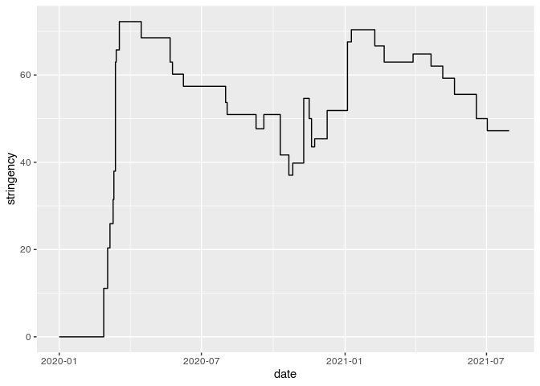

Stringency Index - Oxford Covid-19 Government Response Tracker (OxCGRT)
================
Johannes Enevoldsen

> This document is generated from [README.rmd](README.rmd)

The OxCGRT stringency index is an attempt to quantify the degree to
which a given government enforces restrictions on its citizens with the
aim of reducing the spread of COVID-19.

From the [official website](https://covidtracker.bsg.ox.ac.uk/):

> Governments are taking a wide range of measures to tackle the COVID-19
> outbreak. We aim to track and compare worldwide government responses
> to the coronavirus rigorously and consistently. Systematic information
> on which measures governments take, and when, can help us understand
> the responses in a consistent way, aiding efforts to fight the
> pandemic.

The [official website](https://covidtracker.bsg.ox.ac.uk/) provide a lot
of information about the different types of restrictions that go into
the stringency index. Timeseries about the individual restrictions can
also be accessed.

Here we will download an plot the timeseries of the stringency index.

``` r
library(tidyverse)

stringency_index_url <- "https://raw.githubusercontent.com/OxCGRT/covid-policy-tracker/master/data/timeseries/stringency_index.csv"

stringency_index <- read_csv(stringency_index_url)

print(stringency_index, n_extra = 10)
```

    ## # A tibble: 186 x 583
    ##       X1 country_code country_name         `01Jan2020` `02Jan2020` `03Jan2020`
    ##    <dbl> <chr>        <chr>                      <dbl>       <dbl>       <dbl>
    ##  1     1 ABW          Aruba                          0           0           0
    ##  2     2 AFG          Afghanistan                    0           0           0
    ##  3     3 AGO          Angola                         0           0           0
    ##  4     4 ALB          Albania                        0           0           0
    ##  5     5 AND          Andorra                        0           0           0
    ##  6     6 ARE          United Arab Emirates           0           0           0
    ##  7     7 ARG          Argentina                      0           0           0
    ##  8     8 AUS          Australia                      0           0           0
    ##  9     9 AUT          Austria                        0           0           0
    ## 10    10 AZE          Azerbaijan                     0           0           0
    ## # … with 176 more rows, and 577 more variables: 04Jan2020 <dbl>,
    ## #   05Jan2020 <dbl>, 06Jan2020 <dbl>, 07Jan2020 <dbl>, 08Jan2020 <dbl>,
    ## #   09Jan2020 <dbl>, 10Jan2020 <dbl>, 11Jan2020 <dbl>, 12Jan2020 <dbl>,
    ## #   13Jan2020 <dbl>, …

The data is in a wide format, with dates in column headers. First, we
should pivot it longer.

``` r
stringency_index_long <- pivot_longer(stringency_index, -c(X1, country_code, country_name),
                                      names_to = "date", 
                                      values_to = "stringency") %>% 
  mutate(date = lubridate::dmy(date))

stringency_index_long
```

    ## # A tibble: 107,880 x 5
    ##       X1 country_code country_name date       stringency
    ##    <dbl> <chr>        <chr>        <date>          <dbl>
    ##  1     1 ABW          Aruba        2020-01-01          0
    ##  2     1 ABW          Aruba        2020-01-02          0
    ##  3     1 ABW          Aruba        2020-01-03          0
    ##  4     1 ABW          Aruba        2020-01-04          0
    ##  5     1 ABW          Aruba        2020-01-05          0
    ##  6     1 ABW          Aruba        2020-01-06          0
    ##  7     1 ABW          Aruba        2020-01-07          0
    ##  8     1 ABW          Aruba        2020-01-08          0
    ##  9     1 ABW          Aruba        2020-01-09          0
    ## 10     1 ABW          Aruba        2020-01-10          0
    ## # … with 107,870 more rows

Stringency index in Denmark

``` r
stringency_index_long %>% 
  filter(country_name == "Denmark") %>% 
  ggplot(aes(date, stringency)) + 
  geom_step() + 
  scale_x_date()
```

<!-- -->
