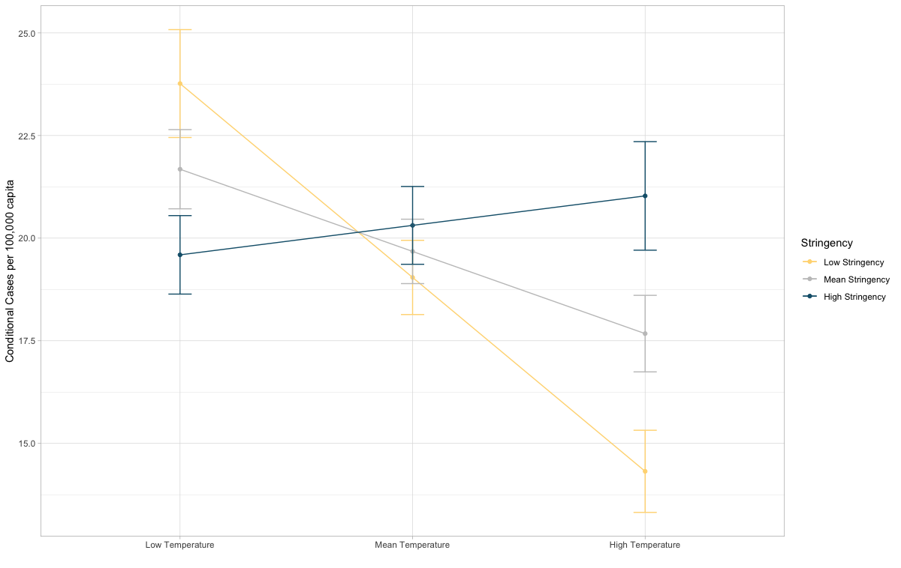
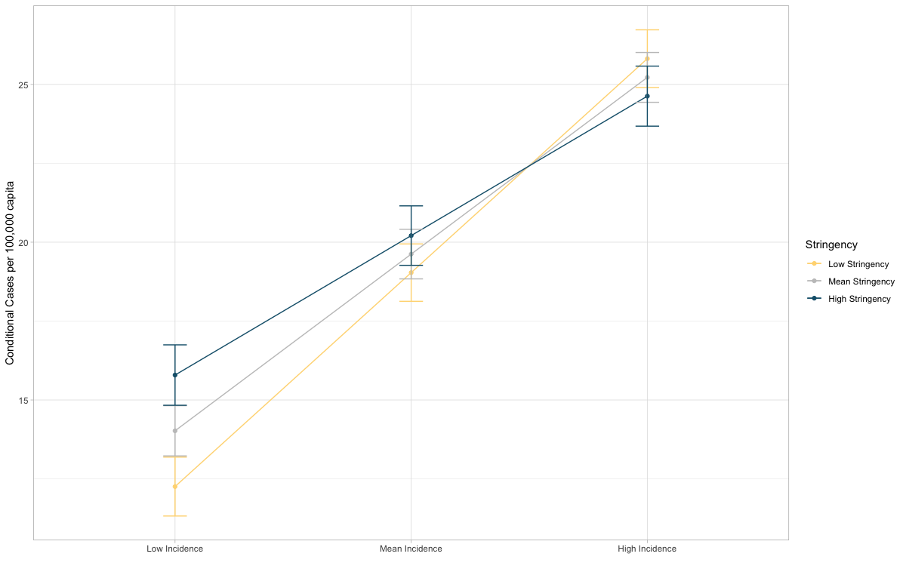
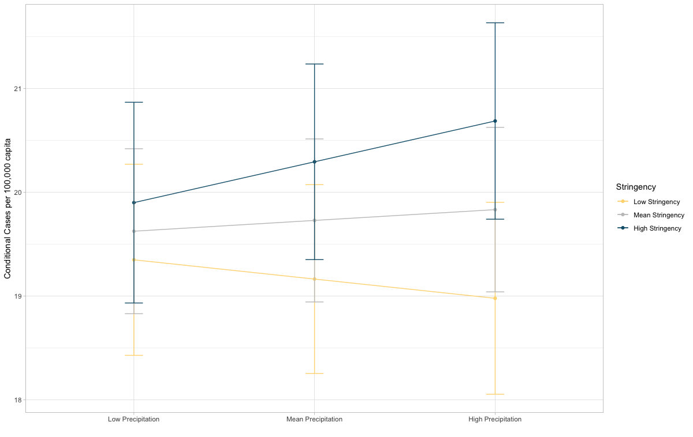
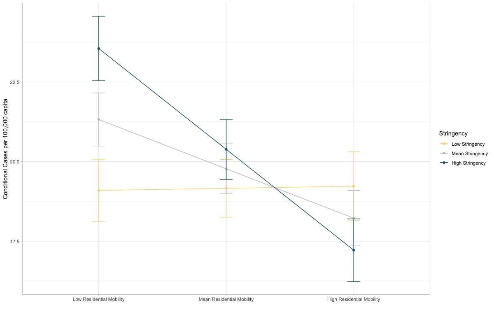
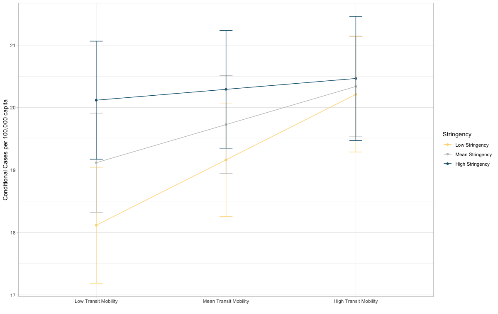
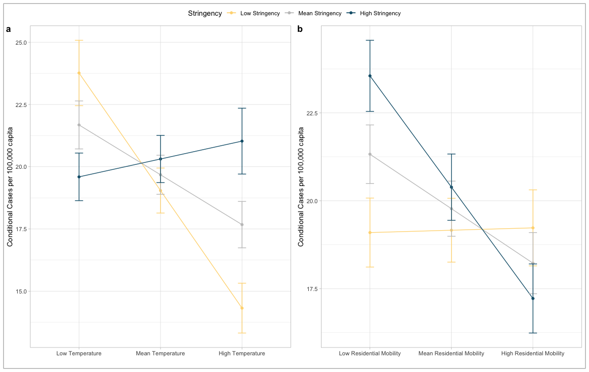
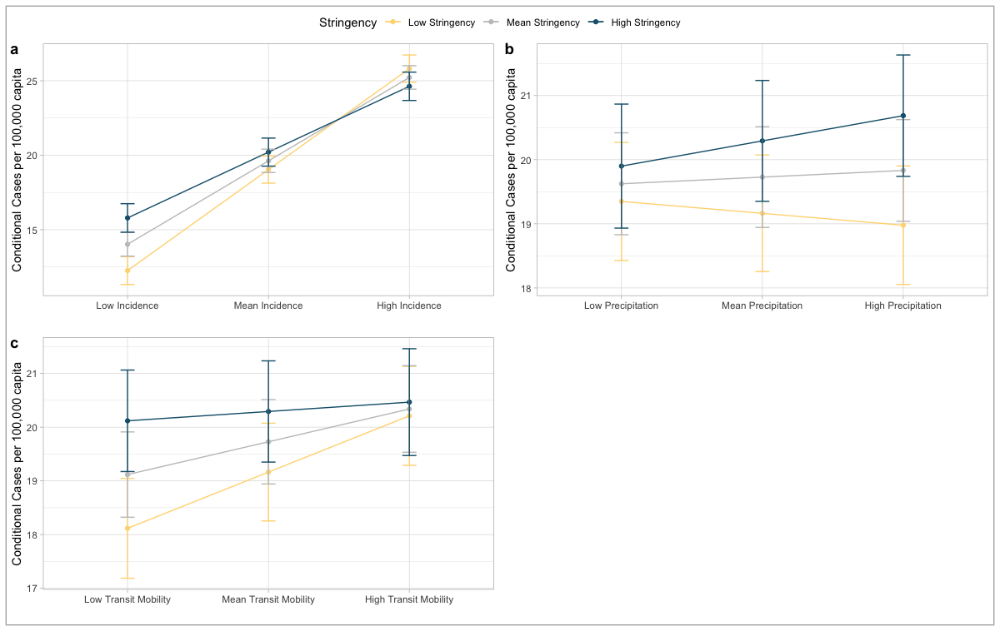
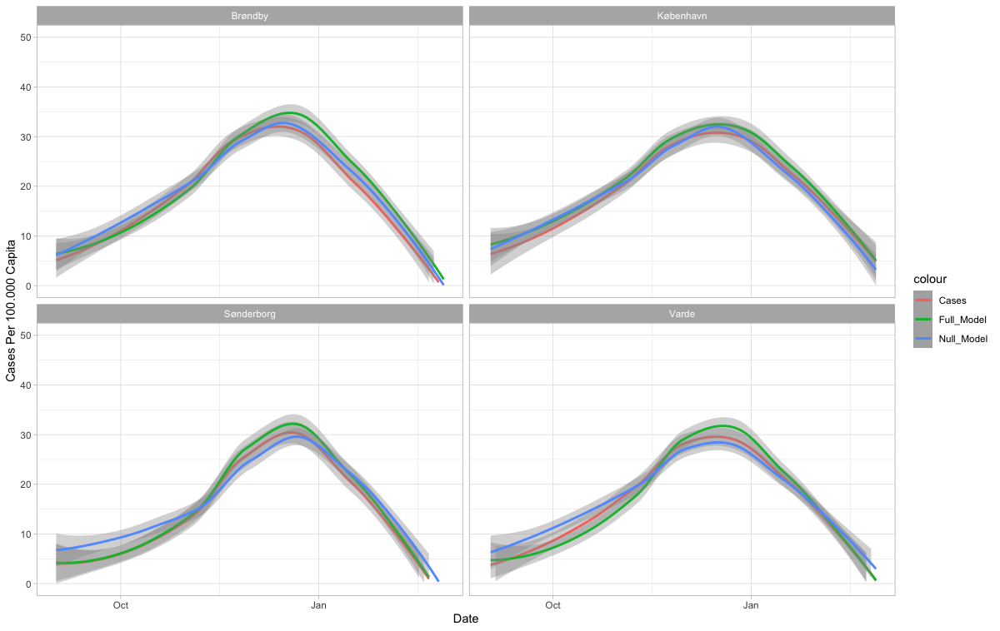
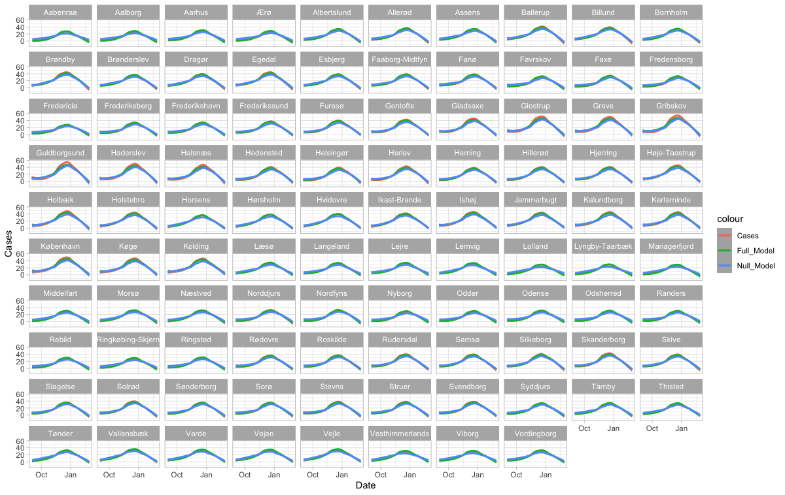

Social Compliance Plots and Analysis
================
### Authored and composed by Lasse Hyldig Hansen:

#### https://www.linkedin.com/in/lasse-hyldig-hansen-a1ab1216a/
2021-08-11

The current folder is a collection of all scripts, functions and data-files that are needed to replicate the analysis from the following paper: 

https://www.researchsquare.com/article/rs-501561/v1

### This Script

This script shows how the analysis and plots for the paper “Social
Compliance During High Stringency Periods Eciently Reduces COVID-19
Incidence: Evidence from Google Mobility Reports”.

The following code takes its standing from the preprocessing script. 

Therefore, I will start by loading the packages needed, and then load the csv file
generated in the preprocessing script.

If you did not run the preprocessing script, you can download the file from the folder "Materials".

First I load the packages needed:

``` r
pacman::p_load(tidyverse, 
               purrr, 
               tidyr, 
               stringr, 
               Boruta, 
               ggplot2,
               sandwich,
               survival,
               car,
               ggpubr,
               pracma,
               effects,
               lme4
               )
```

Then I read the data from the pre processing script avaliable in the folder:

``` r
d10 = read_csv("data_for_analysis.csv")
```

### Running mixed-effects model

The two linear mixed effects model are then run, with cases as the
Y-variable and the variables of interest as x variables.

Random intercepts for municipalities and dates are taken with the
following syntax: (1|Date) + (1 | Kommune)

Further a null model is also run (reg2), this is two compare the
explanatory power of the variables added in
reg1.

``` r
reg1 <- lmer(data = d10, Cases ~ (Cases_lag9  +  Residential_Change_lag + Transit_Change_lag + Precip_lag + Temp_lag)*Stringency + Bebyggelse + Under_30 + (1|Date) + (1 | Kommune))
reg2 <- lm(data = d10, Cases ~ Cases_lag9 * Stringency)
```

Afterwatds I obtain the Marginal and Conditional Rsquared, with the
MuMIn package. This will calculate the amount of variance explained by
the x-variables.

### Summary statistics and proportional variance explained

``` r
MuMIn::r.squaredGLMM(reg1)
```

    ## Warning: 'r.squaredGLMM' now calculates a revised statistic. See the help page.

    ##            R2m      R2c
    ## [1,] 0.2949151 0.860457

Then I can get the Summary Statistics from the mixed effects models.
This will give me coefficient information with p-values accordingly.

``` r
summary(reg1)
```

    ## Linear mixed model fit by REML ['lmerMod']
    ## Formula: Cases ~ (Cases_lag9 + Residential_Change_lag + Transit_Change_lag +  
    ##     Precip_lag + Temp_lag) * Stringency + Bebyggelse + Under_30 +  
    ##     (1 | Date) + (1 | Kommune)
    ##    Data: d10
    ## 
    ## REML criterion at convergence: 104132.6
    ## 
    ## Scaled residuals: 
    ##     Min      1Q  Median      3Q     Max 
    ## -7.3230 -0.5252 -0.0573  0.4594  8.8073 
    ## 
    ## Random effects:
    ##  Groups   Name        Variance Std.Dev.
    ##  Date     (Intercept) 82.61    9.089   
    ##  Kommune  (Intercept)  4.71    2.170   
    ##  Residual             21.55    4.642   
    ## Number of obs: 17384, groups:  Date, 181; Kommune, 98
    ## 
    ## Fixed effects:
    ##                                   Estimate Std. Error t value
    ## (Intercept)                        19.6162     0.7840  25.021
    ## Cases_lag9                          5.6000     0.1081  51.824
    ## Residential_Change_lag             -1.5496     0.3308  -4.684
    ## Transit_Change_lag                  0.6106     0.1545   3.953
    ## Precip_lag                          0.1039     0.1140   0.912
    ## Temp_lag                           -2.0027     0.5332  -3.756
    ## Stringency                          0.7048     0.4921   1.432
    ## Bebyggelse                         -0.6658     0.2556  -2.605
    ## Under_30                           -0.3710     0.2555  -1.452
    ## Cases_lag9:Stringency              -1.1803     0.1116 -10.578
    ## Residential_Change_lag:Stringency  -1.6165     0.2540  -6.365
    ## Transit_Change_lag:Stringency      -0.4368     0.1311  -3.332
    ## Precip_lag:Stringency               0.2893     0.1117   2.591
    ## Temp_lag:Stringency                 2.7207     0.4532   6.003

    ## 
    ## Correlation matrix not shown by default, as p = 14 > 12.
    ## Use print(x, correlation=TRUE)  or
    ##     vcov(x)        if you need it

``` r
summary(reg2)
```

    ## 
    ## Call:
    ## lm(formula = Cases ~ Cases_lag9 * Stringency, data = d10)
    ## 
    ## Residuals:
    ##     Min      1Q  Median      3Q     Max 
    ## -58.032  -4.488  -1.517   2.863  68.101 
    ## 
    ## Coefficients:
    ##                       Estimate Std. Error t value Pr(>|t|)    
    ## (Intercept)           17.20599    0.07468  230.38   <2e-16 ***
    ## Cases_lag9            11.21081    0.07465  150.18   <2e-16 ***
    ## Stringency            -3.23891    0.07434  -43.57   <2e-16 ***
    ## Cases_lag9:Stringency -2.44050    0.09975  -24.47   <2e-16 ***
    ## ---
    ## Signif. codes:  0 '***' 0.001 '**' 0.01 '*' 0.05 '.' 0.1 ' ' 1
    ## 
    ## Residual standard error: 9.739 on 17380 degrees of freedom
    ## Multiple R-squared:  0.5724, Adjusted R-squared:  0.5723 
    ## F-statistic:  7756 on 3 and 17380 DF,  p-value: < 2.2e-16

### Model comparison

Further, a Model Comparison is made, with the anova() function, this
compares the out of sample error from the full model (reg1) and the null
model (reg2)

``` r
anova(reg1, reg2)
```

    ## refitting model(s) with ML (instead of REML)

    ## Data: d10
    ## Models:
    ## reg2: Cases ~ Cases_lag9 * Stringency
    ## reg1: Cases ~ (Cases_lag9 + Residential_Change_lag + Transit_Change_lag + 
    ## reg1:     Precip_lag + Temp_lag) * Stringency + Bebyggelse + Under_30 + 
    ## reg1:     (1 | Date) + (1 | Kommune)
    ##      npar    AIC    BIC logLik deviance Chisq Df Pr(>Chisq)    
    ## reg2    5 128477 128516 -64234   128467                        
    ## reg1   17 104151 104282 -52058   104117 24351 12  < 2.2e-16 ***
    ## ---
    ## Signif. codes:  0 '***' 0.001 '**' 0.01 '*' 0.05 '.' 0.1 ' ' 1
    
## Making figures

### Understanding interactions with plots

Making Interaction plots is done by first calculating the expected
intereaction effects between the x-variables. Afterwards the interacting
variable is set to three levels, and is plotted. The plot is made with
ggplot2:

``` r
Inter.HandPick1 <- effect('Temp_lag:Stringency', reg1, 
                                              xlevels=list(Temp_lag = c(-1, 0, 1),
                                              Stringency = c(-1, 0, 1)),
                                              se=TRUE, confidence.level=.95, typical=mean)

Inter.HandPick1 = data.frame(Inter.HandPick1)

Inter.HandPick1$Stringency = ifelse(Inter.HandPick1$Stringency == -1, "Low Stringency", 
                            ifelse(Inter.HandPick1$Stringency == 0, "Mean Stringency", "High Stringency"))

Inter.HandPick1$Temp_lag = ifelse(Inter.HandPick1$Temp_lag == -1, "Low Temperature", 
                            ifelse(Inter.HandPick1$Temp_lag == 0, "Mean Temperature", "High Temperature"))

Inter.HandPick1$Temp_lag <- factor(Inter.HandPick1$Temp_lag, levels = c("Low Temperature", "Mean Temperature", "High Temperature"))
Inter.HandPick1$Stringency <- factor(Inter.HandPick1$Stringency, levels = c("Low Stringency", "Mean Stringency", "High Stringency"))
geom.text.size = 8
theme.size = (14/5) * geom.text.size

p1<- ggplot(Inter.HandPick1, aes(x=Temp_lag, y=fit, group=Stringency, color=Stringency)) + 
  geom_line() +
  geom_point()+
  geom_errorbar(aes(ymin=fit-se, ymax=fit+se), width=.1,
                 ) + scale_color_manual(values=c('#ffd882','#c4c4c4', '#15607a')) +
  labs("Interaction effect of Stringency and Temperature", x="", y = "Conditional Cases per 100,000 capita") + 
  theme(axis.text = element_text(size = theme.size)) + theme_light()

p1
```

<!-- -->

``` r
Inter.HandPick2 <- effect('Cases_lag9:Stringency', reg1, 
                                              xlevels=list(Cases_lag9 = c(-1, 0, 1),
                                              Stringency = c(-1, 0, 1)),
                                              se=TRUE, confidence.level=.95, typical=mean)
Inter.HandPick2 = data.frame(Inter.HandPick2)

Inter.HandPick2$Stringency = ifelse(Inter.HandPick2$Stringency == -1, "Low Stringency", 
                            ifelse(Inter.HandPick2$Stringency == 0, "Mean Stringency", "High Stringency"))

Inter.HandPick2$Cases_lag9 = ifelse(Inter.HandPick2$Cases_lag9 == -1, "Low Incidence", 
                            ifelse(Inter.HandPick2$Cases_lag9 == 0, "Mean Incidence", "High Incidence"))

Inter.HandPick2$Cases_lag9 <- factor(Inter.HandPick2$Cases_lag9, levels = c("Low Incidence", "Mean Incidence", "High Incidence"))
Inter.HandPick2$Stringency <- factor(Inter.HandPick2$Stringency, levels = c("Low Stringency", "Mean Stringency", "High Stringency"))


p2<- ggplot(Inter.HandPick2, aes(x=Cases_lag9, y=fit, group=Stringency, color=Stringency)) + 
  geom_line() +
  geom_point()+
  geom_errorbar(aes(ymin=fit-se, ymax=fit+se), width=.1,
                 ) + scale_color_manual(values=c('#ffd882','#c4c4c4', '#15607a')) +
  labs("Interaction effect of Stringency and autoregresive Cases", x="", y = "Conditional Cases per 100,000 capita") + 
  theme(axis.text = element_text(size = theme.size))+ theme_light()

p2
```

<!-- -->

``` r
Inter.HandPick3 <- effect('Precip_lag:Stringency', reg1, 
                                              xlevels=list(Precip_lag = c(-1, 0, 1),
                                              Stringency = c(-1, 0, 1)),
                                              se=TRUE, confidence.level=.95, typical=mean)
Inter.HandPick3 = data.frame(Inter.HandPick3)

Inter.HandPick3$Stringency = ifelse(Inter.HandPick3$Stringency == -1, "Low Stringency", 
                            ifelse(Inter.HandPick3$Stringency == 0, "Mean Stringency", "High Stringency"))

Inter.HandPick3$Precip_lag = ifelse(Inter.HandPick3$Precip_lag == -1, "Low Precipitation", 
                            ifelse(Inter.HandPick3$Precip_lag == 0, "Mean Precipitation", "High Precipitation"))

Inter.HandPick3$Precip_lag <- factor(Inter.HandPick3$Precip_lag, levels = c("Low Precipitation", "Mean Precipitation", "High Precipitation"))
Inter.HandPick3$Stringency <- factor(Inter.HandPick3$Stringency, levels = c("Low Stringency", "Mean Stringency", "High Stringency"))


p3<- ggplot(Inter.HandPick3, aes(x=Precip_lag, y=fit, group=Stringency, color=Stringency)) + 
  geom_line() +
  geom_point()+
  geom_errorbar(aes(ymin=fit-se, ymax=fit+se), width=.1,
                 ) + scale_color_manual(values=c('#ffd882','#c4c4c4', '#15607a')) +
  labs("Interaction effect of Stringency and Precipitation", x="", y = "Conditional Cases per 100,000 capita") + 
  theme(axis.text = element_text(size = theme.size))+ theme_light()

p3
```

<!-- -->

``` r
Inter.HandPick4 <- effect('Residential_Change_lag:Stringency', reg1, 
                                              xlevels=list(Residential_Change_lag = c(-1, 0, 1),
                                              Stringency = c(-1, 0, 1)),
                                              se=TRUE, confidence.level=.95, typical=mean)
Inter.HandPick4 = data.frame(Inter.HandPick4)

Inter.HandPick4$Stringency = ifelse(Inter.HandPick4$Stringency == -1, "Low Stringency", 
                            ifelse(Inter.HandPick4$Stringency == 0, "Mean Stringency", "High Stringency"))

Inter.HandPick4$Residential_Change_lag = ifelse(Inter.HandPick4$Residential_Change_lag == -1, "Low Residential Mobility", 
                            ifelse(Inter.HandPick4$Residential_Change_lag == 0, "Mean Residential Mobility", "High Residential Mobility"))

Inter.HandPick4$Residential_Change_lag <- factor(Inter.HandPick4$Residential_Change_lag, levels = c("Low Residential Mobility", "Mean Residential Mobility", "High Residential Mobility"))
Inter.HandPick4$Stringency <- factor(Inter.HandPick4$Stringency, levels = c("Low Stringency", "Mean Stringency", "High Stringency"))


p4<- ggplot(Inter.HandPick4, aes(x=Residential_Change_lag, y=fit, group=Stringency, color=Stringency)) + 
  geom_line() +
  geom_point()+
  geom_errorbar(aes(ymin=fit-se, ymax=fit+se), width=.1,
                 ) + scale_color_manual(values=c('#ffd882','#c4c4c4', '#15607a')) +
  labs("Interaction effect of Stringency and Residential Mobility Change", x="", y = "Conditional Cases per 100,000 capita")+ 
  theme(axis.text = element_text(size = theme.size))+theme_light()

p4
```

<!-- -->

``` r
Inter.HandPick5 <- effect('Transit_Change_lag:Stringency', reg1, 
                                              xlevels=list(Transit_Change_lag = c(-1, 0, 1),
                                              Stringency = c(-1, 0, 1)),
                                              se=TRUE, confidence.level=.95, typical=mean)
Inter.HandPick5 = data.frame(Inter.HandPick5)

Inter.HandPick5$Stringency = ifelse(Inter.HandPick5$Stringency == -1, "Low Stringency", 
                            ifelse(Inter.HandPick5$Stringency == 0, "Mean Stringency", "High Stringency"))

Inter.HandPick5$Transit_Change_lag = ifelse(Inter.HandPick5$Transit_Change_lag == -1, "Low Transit Mobility", 
                            ifelse(Inter.HandPick5$Transit_Change_lag == 0, "Mean Transit Mobility", "High Transit Mobility"))

Inter.HandPick5$Transit_Change_lag <- factor(Inter.HandPick5$Transit_Change_lag, levels = c("Low Transit Mobility", "Mean Transit Mobility", "High Transit Mobility"))
Inter.HandPick5$Stringency <- factor(Inter.HandPick5$Stringency, levels = c("Low Stringency", "Mean Stringency", "High Stringency"))


p5<- ggplot(Inter.HandPick5, aes(x=Transit_Change_lag, y=fit, group=Stringency, color=Stringency)) + 
  geom_line() +
  geom_point()+
  geom_errorbar(aes(ymin=fit-se, ymax=fit+se), width=.1,
                 ) + scale_color_manual(values=c('#ffd882','#c4c4c4', '#15607a')) +
  labs("Interaction effect of Stringency and Transit Mobility Change", x="", y = "Conditional Cases per 100,000 capita") + 
  theme(axis.text = element_text(size = theme.size))+ theme_light()

p5
```

<!-- -->

### Creating the two first figures from the paper

The two figures from the paper can be made with ggarrange in this
way:

``` r
ggarrange(p1, p4,labels = c("a","b"), ncol = 2, nrow = 1, common.legend = T) + 
  theme(axis.text = element_text(size = theme.size))+ theme_light()

```

<!-- -->

``` r
ggarrange(p2,p3, p5, labels = c("a","b", "c"), ncol = 2, nrow = 2, common.legend = T) + 
  theme(axis.text = element_text(size = theme.size))+ theme_light()

```

<!-- -->


### Making plots of predicted values

Getting predicted values from the two models are done by using the
function fitted():

``` r
d10$Full_Model <- fitted(reg1, d10)
d10$Null_Model <- fitted(reg2, d10)
```

Afterwards I make a dataframe for visualizing the effect of some random
municipalities in the paper:

``` r
d11 = d10 %>% filter(.$Kommune %in% c("Sønderborg", "Varde", "Brøndby", "København"))
```

Then I can plot the fitted values from both models compared to actual
cases for the four aforementioned municipalities:

``` r
ggplot(data = d11, aes(Date, )) +
  geom_smooth(aes(y = Cases, colour = "Cases")) +
  geom_smooth(aes(y = Full_Model, colour = "Full_Model")) +
  geom_smooth(aes(y = Null_Model, colour = "Null_Model")) +
  facet_wrap(~ Kommune) +
  theme(axis.text = element_text(size = theme.size))+ 
   theme_light() + 
   ylim(0,50) + 
   ylab("Cases Per 100.000 Capita")
```

<!-- -->

Lastly I plot fitted values from both models compared to actual cases
for all municipalities:

``` r
ggplot(data = d10, aes(Date, )) +
  geom_smooth(aes(y = Cases, colour = "Cases",level = 0.95)) +
  geom_smooth(aes(y = Full_Model, colour = "Full_Model", level = 0.95)) +
  geom_smooth(aes(y = Null_Model, colour = "Null_Model", level = 0.95)) +
  facet_wrap(~ Kommune) +
  theme(axis.text = element_text(size = theme.size))+ theme_light()
```

<!-- -->
