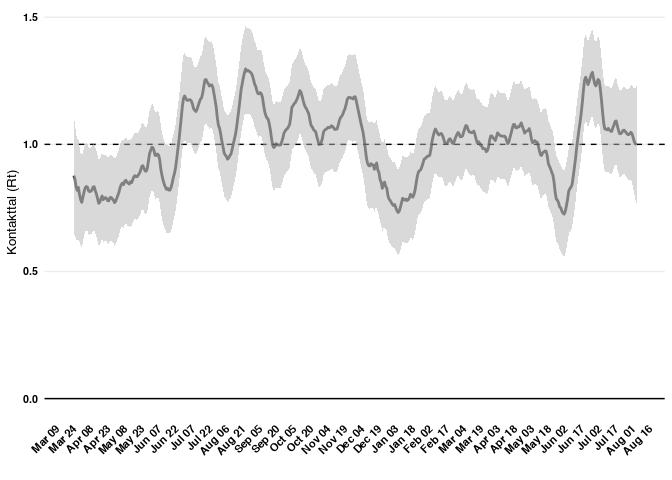

Using data from SSI to calculate the reproduction number
================
Nicklas Myrthue Thorsen

This is a brief introduction to reading in data from the SSI website and
using it to estimate the reproduction number.

This was made in R 4.1.0.

The package that is used to calculate the reproduction number in DIAS is
called Covid19RR and is available via github
<https://github.com/ku-awdc/Covid19RR/>. The github page also has
details on how to install it.

``` r
library("tidyverse")
library("Covid19RR")
```

The daily file on SSI’s website has a tail of random numbers and
letters, which means we cannot know the full path ahead of time for
usage in an automatic system. The following is one way to get around
this.

``` r
### This is the url where the link to the file is located
### once it is available (all weekdays at 14:00 unless there are problems).
url <- paste0("https://covid19.ssi.dk/overvagningsdata/",
              "download-fil-med-overvaagningdata")

### We read the html code into R.
html <- paste(readLines(url), collapse = "\n")

### This code matches links to the zip files of interest.
match_url <- paste0("<a href=\"https://files.ssi.dk/covid19/",
                    "overvagning/data/overvaagningsdata-covid19-(.*?)\"")

### We take the first of these matches, which will be the most recent zip-file
### containing the data we want.
dl_url <- str_match(html, match_url)[,1]
dl_url
```

    ## [1] "<a href=\"https://files.ssi.dk/covid19/overvagning/data/overvaagningsdata-covid19-16082021-cmed\""

``` r
### Get rid of the html code around the link itself.
dl_url <- substring(dl_url, 10, nchar(dl_url) - 1)
dl_url
```

    ## [1] "https://files.ssi.dk/covid19/overvagning/data/overvaagningsdata-covid19-16082021-cmed"

``` r
### Extract the date from the most recent zip file available.
dl_date <- str_match(dl_url, "[[:digit:]]{8}") %>% as.Date("%d%m%Y")
dl_date
```

    ## [1] "2021-08-16"

``` r
### Download the zip file. Note that mode = wb is necessary for R in Windows,
### but that this depends a bit on the system. We use a temporary path here,
### but you can save the downloaded file in a destination if you want to keep
### it after the program has run.
temp <- tempfile()
download.file(dl_url, temp, mode = "wb")
```

We are now ready to extract the data we downloaded and calculate the
reproduction number.

``` r
### Grab the data we need from the zip file.
data <- read_csv2(unz(temp, "Test_pos_over_time.csv"),
                  col_types = list(
                    Date = col_date(format = "")
                  )) 

### Apply the filter used in SSI where we discard data from
### before April 1 2020 and data from the 3 most recent days to
### avoid issues with incomplete data. First we remove the 2 summary rows at
### the end of the file.
data <- data[1:(nrow(data) - 2),]

data <- data %>% filter(Date <= dl_date - 3 & Date >= as.Date("2020-04-01"))

### The model can now be estimated using this data.
### Beta is a parameter specifying the relation between testing
### and positive cases found by the formula cases = a * tests ^ beta.
### logtau can be thought of as a smoothing parameter.
mod <- estimate_cv19rr(data, beta = 0.3, logtau = log(7))

### The models made by estimate_cv19rr can easily be made into a table
### using as.data.frame on the object.
df <- as.data.frame(mod)

### In this case we are interested in the reproduction number,
### which we can take from this table.
df_r <- df %>% select(Date, R, R.UCI, R.LCI)

### The most recent reproduction number is the one that has been reported
### as "ugens smittetal" by the government.
tail(df_r)
```

    ##           Date         R    R.UCI     R.LCI
    ## 495 2021-08-01 1.0473756 1.232952 0.8617996
    ## 496 2021-08-02 1.0423179 1.233166 0.8514699
    ## 497 2021-08-03 1.0274089 1.225054 0.8297643
    ## 498 2021-08-04 1.0110188 1.217361 0.8046772
    ## 499 2021-08-05 1.0022807 1.219656 0.7849052
    ## 500 2021-08-06 0.9997237 1.230954 0.7684936

The weekly plot with its lower and upper confidence interval is also
based on this time series.

``` r
rt_plot <- 
  ggplot() +
  geom_line(data = df_r,
            aes(x = Date, y = R), alpha = 0.7, size = 1) +
  geom_hline(yintercept = 1, linetype = "dashed", color = "black") +
  geom_hline(yintercept = 0, color = "black") +
  geom_ribbon(
    data = df_r, 
    aes(
      ymin = R.LCI, 
      ymax = R.UCI,
      x = Date
    ), 
    alpha=0.5,
    fill = "grey70"
  ) +
  scale_x_date(breaks = "15 day", date_labels = "%b %d") +
  labs(
    y = "Kontakttal (Rt)",
    x = ""
  ) +
  theme_minimal() +
  theme(
    panel.grid.minor = element_blank(),
    panel.grid.major.x = element_blank(),
    panel.grid.minor.x = element_blank(),
    axis.text = element_text(face = "bold", size = 8, color = "black"),
    axis.title = element_text(size = 10),
    plot.title = element_text(face = "bold", size = 14),
    axis.text.x = element_text(angle = 45, hjust = 1),
    legend.position = "bottom"
  )

rt_plot
```

<!-- -->
