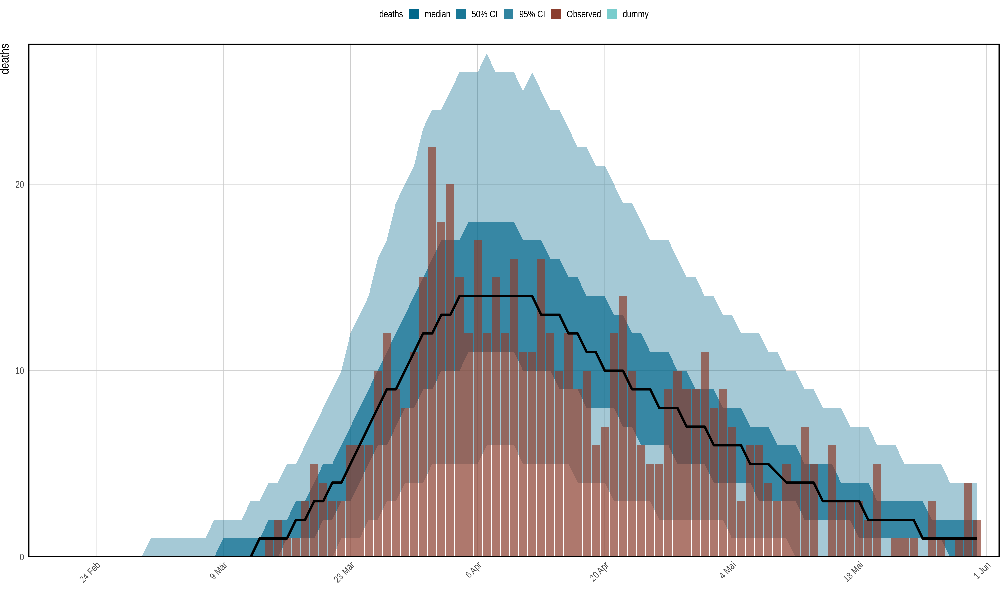
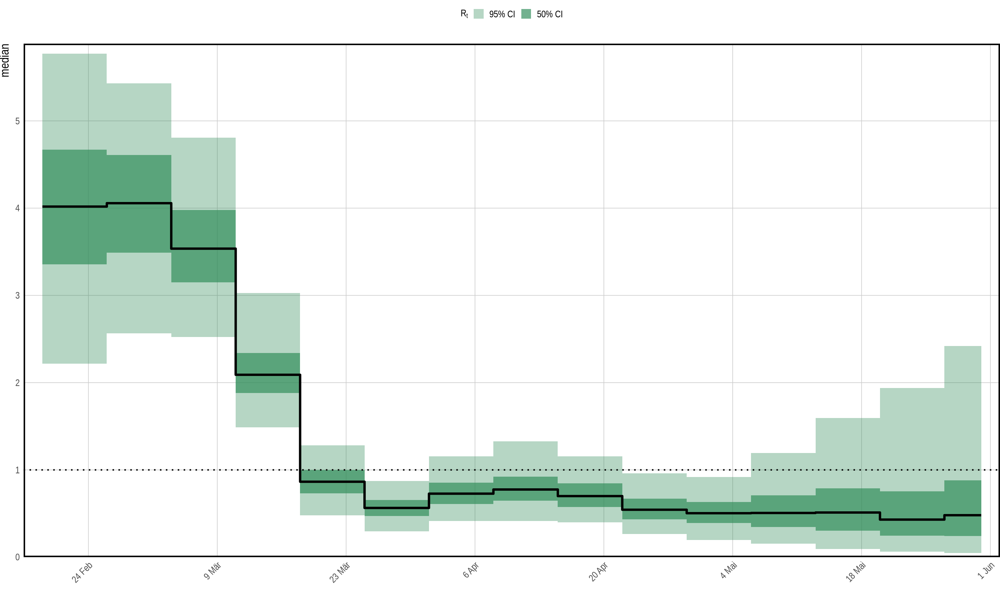
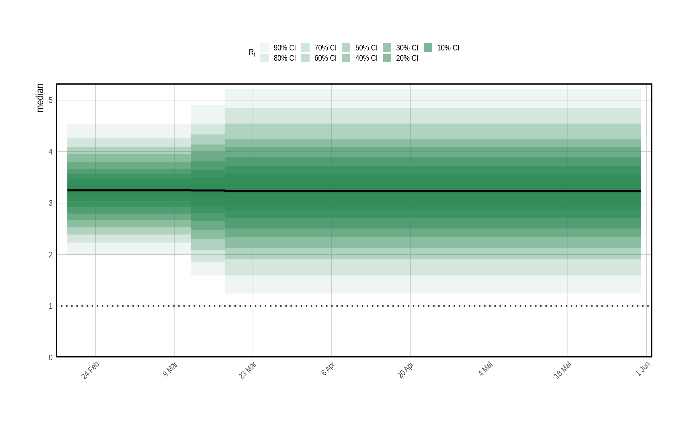
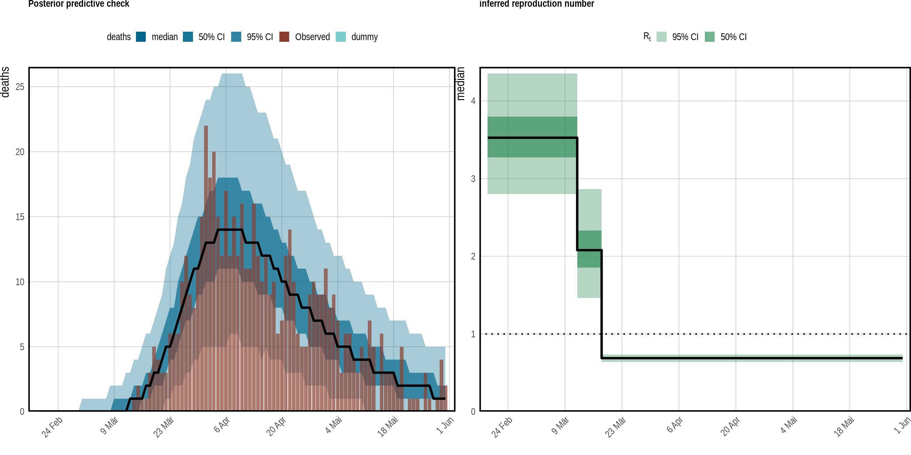
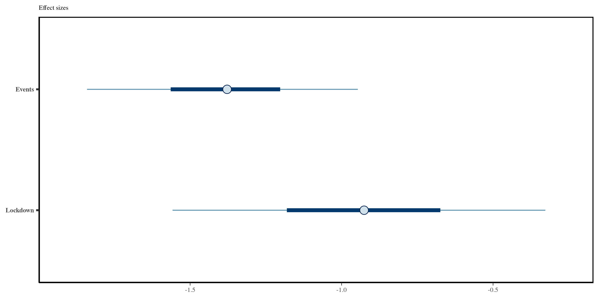
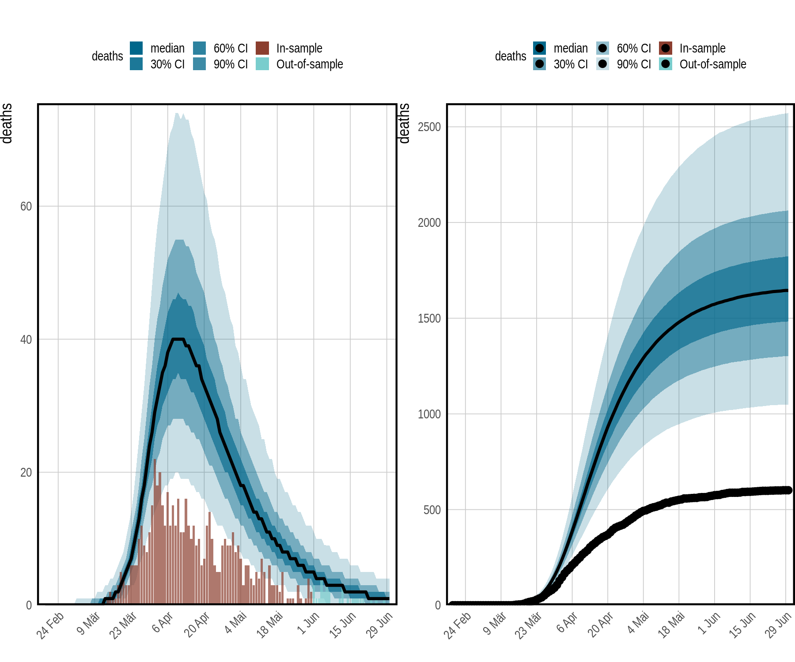
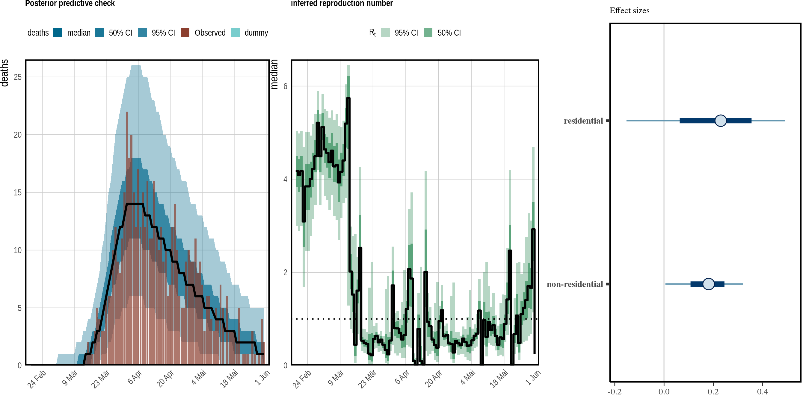

Modelling Epidemics with Time Series Data and Epidemia
================
Andreas Koher

# Modelling the Covid-19 pandemic with Time Series data and Epidemia

This tutorial follows closely the examples presented in
[epidemia](https://imperialcollegelondon.github.io/epidemia/articles/europe-covid.html)
and for mathematical details, please refer to the model
[description](https://imperialcollegelondon.github.io/epidemia/articles/model-description.html).

Our aim is to leverage the semi-mechanistic modelling approach of
*epidemia* and model the first wave of Covid-19 infections using various
time series data such as Google mobility, telco data, the stringency
index, and non-pharaceutical interventions (NPI). To begin, we first
load some packages.

``` r
library(epidemia)
library(lubridate)
library(rstanarm)
library(dplyr)
options(mc.cores = parallel::detectCores())
```

## Data

We compiled a data set for you with daily cases, hospitalizations and
deaths according to SSI. In addtion we have five time series with binary
elements that indicate the presence of a non-pharamaceutical
intervention. These include:

-   closing of schools and universities
-   banning of public events
-   encouraging social distancing
-   requiring self isolation if ill
-   full lockdown.

We also include the [stringency
index](https://covidtracker.bsg.ox.ac.uk/), i.e. a time series that
summarizes the presence of various NPIs into a single number, which can
be used for epidemic modelling. We also added Google mobility data as a
potential predictor including the following time series:

-   retail
-   grocery
-   workplaces
-   nonresidential (an average over the quantities above)
-   residential

``` r
data <- read.csv("denmark.csv")
data$week <- week(data$date)
head(data)
```

    ##   country       date schools_universities self_isolating_if_ill public_events
    ## 1 Denmark 2020-01-03                    0                     0             0
    ## 2 Denmark 2020-01-04                    0                     0             0
    ## 3 Denmark 2020-01-05                    0                     0             0
    ## 4 Denmark 2020-01-06                    0                     0             0
    ## 5 Denmark 2020-01-07                    0                     0             0
    ## 6 Denmark 2020-01-08                    0                     0             0
    ##   lockdown social_distancing_encouraged     pop retail grocery workplaces
    ## 1        0                            0 5837213      0       0          0
    ## 2        0                            0 5837213      0       0          0
    ## 3        0                            0 5837213      0       0          0
    ## 4        0                            0 5837213      0       0          0
    ## 5        0                            0 5837213      0       0          0
    ## 6        0                            0 5837213      0       0          0
    ##   residential nonresidential stringency cases hospit deaths week
    ## 1           0              0          0     0      0      0    1
    ## 2           0              0          0     0      0      0    1
    ## 3           0              0          0     0      0      0    1
    ## 4           0              0          0     0      0      0    1
    ## 5           0              0          0     0      0      0    1
    ## 6           0              0          0     0      0      0    2

Following [Flaxman et
al.](https://www.nature.com/articles/s41586-020-2405-7), we seed the
infection 30 days prior to observing 10 cumulative deaths. Also, we stop
observation already in June, i.e. 30 days prior to the last observation
in order evaluate out-of-sample forcasts:

``` r
data <- filter(data, date > date[which(cumsum(deaths) > 10)[1] - 30])
data <- filter(data, date < as.Date("2020-06-01"))
data <- group_by(data, country)
dates <- summarise(data, start = min(date), end = max(date))
head(dates)
```

    ## # A tibble: 1 × 3
    ##   country start      end       
    ##   <chr>   <chr>      <chr>     
    ## 1 Denmark 2020-02-19 2020-05-31

Two crucial distributions for modelling are the generation distribution
and the observation delay distribution. Here, we follow [Flaxman et
al.](https://www.nature.com/articles/s41586-020-2405-7) and assume that
the generation distribution equals the serial interval. We take the
latter together with the delay distribution from the data set
`EuropeCovid2` that accompanies *epidemia*:

``` r
#delays <- read.csv("/home/and/Datathon/data/delaydist.csv")
data("EuropeCovid2")
inf2death <- EuropeCovid2$inf2death
serial_interval <- EuropeCovid2$si
```

### Model Components

The model setup requires the user to define three components:

-   an observation model
-   an infection model
-   a transmission model

### Observations

We fit the model to daily death counts, though *epidemia* can also deal
with multiple observations including case counts and number of
hospitalizations, as well as representative PCR and serological studies
(see this
[example](https://imperialcollegelondon.github.io/epidemia/articles/multiple-obs.html)
for more information).

``` r
deaths <- epiobs(formula = deaths ~ 1, i2o = inf2death, 
                 prior_intercept = normal(0,0.2), link = scaled_logit(0.02))
```

In our simple example, we use an intercept model (`formula`) for the
infection fatality rate (IFR), which assumes that IFR is constant over
time. The `link` function asserts that the IFR stays between 0% and 2%
and the `prior_intercept` reflects our assumption that IFR is close to
1%. The infection-to-observation distribution `i2o` is provided by the
`EuropeCovid2` data set. As a side note, on could use more elaborate
models for the ascertainment rate, such as a latent random walk to track
changes over time or fit predictors such as the number of PCR and
antigen test for an observation model of case counts.

### Infections

Our observations inform the latent number of new infections. In this
example, we link both quantities using the renewal equation as discussed
in the model
[description](https://imperialcollegelondon.github.io/epidemia/articles/model-description.html).
We extent the deterministic renewal equation and add variance to the
process by calling `latent = TRUE`. This is particularly useful for low
number of observations, where stochasticity plays a significant role.

``` r
inf <-  epiinf(gen = serial_interval,
                # latent = TRUE,
                # prior_aux = normal(10,2), 
               seed_days = 6)
```

As the generation distribution, we take the serial interval as in
[Flaxman et al.](https://www.nature.com/articles/s41586-020-2405-7) and
`prior_aux` sets the prior on the coefficient of dispersion for the
latent number of infections. This prior assumes that infections have
conditional variance around 10 times the conditional mean.

#### Transmission

Finally, the latent infections inform the time varying reproduction
number. In this tutorial, we will explore different parametrizations of
the reproduction number with potentially informative predictors.

##### Random Walk model

We begin with a transmission model without predictors and track the
weekly changes of the reproduction number with a latent random walk.

``` r
rt <- epirt(
  formula = R(country, date) ~ rw(time = week, prior_scale = 0.2),
  link = scaled_logit(7)
)
```

We model the time varying reproduction number with a generalized linear
model, where `formula` defines the linear predictors which are then
transformed by the link function. The random walk updates are defined by
the time series `week` and a prior scale for the step size. The link
function asserts reasonable bounds for *R*<sub>*t*</sub> between 0 and 7

## Model Fitting

The function `epim` connects the different parts of our model. In
particular, `epim` has arguments `rt`, `inf` and `obs` which expect a
description of the transmission model, infection model and observational
models as we did above. Together, these fully define the joint
distribution of data and parameters. Each of these model components are
described in terms of variables that are expected to live in a single
dataframe, `data`. This dataframe must be compatible with the model
components, in the sense that it holds all variables defined in these
models.

In addition to taking a model description and a dataframe, epim has
various additional arguments which specify how the model should be fit.
If algorithm = “sampling” then the model will be fit using Stan’s
adaptive Hamiltonian Monte Carlo sampler. This is done internally by
calling sampling. If algorithm = “meanfield” or algorithm = “fullrank”,
then Stan’s variational Bayes algorithms are used instead, by calling
vb. Any unnamed arguments in the call to epim are passed directly on to
the rstan sampling function. epim returns a fitted model object of class
epimodel, which contains posterior samples from the model along with
other useful objects.

In general, the adaptive Hamiltonian Monte Carlo sampler should be used
for final inference. Nonetheless, fitting these models using HMC is
often computationally demanding, and variational Bayes can often be
fruitful for quickly iterating models.

``` r
args <- list(rt = rt, inf = inf, obs = deaths, data = data, 
             seed = 12345, 
             #refresh = 0,
             algorithm = "sampling",
             iter = 4e3,
             control = list(max_treedepth = 5))
#             tol_rel_obj = 1e-3)
fm_rw <- do.call(epim, args)
```

First, we check the model fit to confirm that the inferred parameters
adequately explain the observed deaths. To this end, we use the function
`plot_obs(fm, type = "deaths", levels = c(50, 95))` as follows:

<div class="figure" style="text-align: center">


<p class="caption">
Posterior predictive checks. Observed daily deaths (red) is plotted as a
bar plot. Credible intervals from the posterior are plotted in shades of
blue, in addition to the posterior median in black.
</p>

</div>

The above figure suggests a successful inference result, which gives
some confidence to study the reproduction number. As we would expect
from the death counts, the reproduction number confirms that the disease
has been under control since middle of March, though uncertainty
increases towards the end of the observation period.

<div class="figure" style="text-align: center">


<p class="caption">
Inferred reproduction numbers in each country. Credible intervals from
the posterior are plotted in shades of green, in addition to the
posterior median in black.
</p>

</div>

# Forecast

Making forecasts with *epidemia* is as simple as changing the dataframe.
Remember that we cropped the last month from our data set and in order
to make predictions on the remaining data we simply include all data and
pass it to the plotting function as follows:

``` r
newdata <- read.csv("denmark.csv")
newdata$week <- week(newdata$date)
newdata <- filter(newdata, date > date[which(cumsum(deaths) > 10)[1] - 30])
newdata <- group_by(newdata, country)
```

<div class="figure" style="text-align: center">


<p class="caption">
Predictions for the last 30 days. Left: The latent random walk within
the transmission model adds to the uncertainty. Right: Predicted deaths
counts.
</p>

</div>

##### estimating NPIs

There has been considerable effort to disentangle and estimate the
effect of various non-pharmaceutical interventions. These measures have
been implemented in quick succession and sometimes on the very same day.
Therefore a thorough analysis should include many countries and pool the
effects in order to minimize regional biases. *epidemia* supports a
joined model of multiple countries and a detailed introduction can be
found in the [multi-level
tutorial](https://imperialcollegelondon.github.io/epidemia/articles/europe-covid.html).
In this example, however, we focus on Denmark only.

A crucial step in modelling effect sizes includes the choice of priors.
To keep things simple, we keep the default priors and refer to the
[multi-level
tutorial](https://imperialcollegelondon.github.io/epidemia/articles/europe-covid.html),
where the authors implement the approach from [Flaxman et
al.](https://www.nature.com/articles/s41586-020-2405-7).

``` r
rt <- epirt(
  formula = R(country, date) ~ 1 + lockdown + public_events,
  link = scaled_logit(6.5)
)
```

We can evaluate the choice of predictors and catch obvious
mis-specifications of the model by sampling from the prior. With
*epidemia*, we simply set `priorPD = TRUE` flag in `epim()` and run the
MCMC sampler:

``` r
args <- list(rt = rt, inf = inf, obs = deaths, data = data, seed = 12345, 
             refresh = 0)
pr_args <- c(args, list(algorithm = "sampling", iter = 1e3, prior_PD = TRUE))
fm_prior <- do.call(epim, pr_args)
```

The figure below summarizes samples of the reproduction number given the
prior distribution. It confirms our expectation of a decreasing step
function each time an NPI is implemented.

<div class="figure" style="text-align: center">


<p class="caption">
A prior predictive check for reproduction numbers *R*<sub>*t*</sub> in
the multilevel model. Only results for the United Kingdom are presented
here. The prior median is shown in black, with credible intervals shown
in various shades of green. The check appears to confirm that
*R*<sub>*t*</sub> follows a step-function.
</p>

</div>

We proceed as in the previous example, i.e we (1) sample the model
including the likelihood to approximate the posterior distributions, (2)
evaluate the model fit:

``` r
args <- list(rt = rt, inf = inf, obs = deaths, data = data, 
             seed = 12345, 
             #refresh = 0,
             algorithm = "sampling",
             iter = 4e3,
             control = list(max_treedepth = 6))
#             tol_rel_obj = 1e-3)
fm_npi <- do.call(epim, args)
```

<div class="figure" style="text-align: center">


<p class="caption">
Left: Posterior predictive check confirms a reasonable it to the
observations. Right: Estimated reproduction number under the assumption
that Rt is fully parametrized by two NPIs.
</p>

</div>

As a last step, we compare the effect size of both measures. To this
end, we can access every model parameter with details explained in
[multi-level
tutorial](https://imperialcollegelondon.github.io/epidemia/articles/europe-covid.html).
Calling `bayesplot::mcmc_intervals(mat)` eventually, produces the plot
below.

<div class="figure" style="text-align: center">


<p class="caption">
Effect sizes for the two policy measures considered
</p>

</div>

We find that large negative effects for both NPIs as we would expect.
However, be reminded that this is just a toy example to demonstrate
inference and results should not be interpreted. In contrast to the
figure above, a carefull analysis in [Flaxman et
al.](https://www.nature.com/articles/s41586-020-2405-7) with pooling
across multiple countries reveals that `lockdown` had by far the
strongest impact.

# Counterfactuals

according to Wikipedia:

> Counterfactual thinking is a concept in psychology that involves the
> human tendency to create possible alternatives to life events that
> have already occurred; something that is contrary to what actually
> happened. Counterfactual thinking is, as it states: “counter to the
> facts”. These thoughts consist of the “What if?” and the “If I had
> only…” that occur when thinking of how things could have turned out
> differently. Counterfactual thoughts include things that – in the
> present – now could never happen in reality because they solely
> pertain to events that have occurred in the past.

Counterfactual modelling requires us to keep the inference results as
they are and only manipulate the input to the model. In other words, if
we believe in a causal relationship between the implementation of NPIs
and disease transmission (not merely a correlation), then we can examine
what would have happened, if NPIs were implemented 30 days later:

``` r
shift <- function(x, k) c(rep(0,k), x[-(1:k)])
#shift <- function(x, k) c(x[-(1:k)], rep(0,k))
days <- 30

newdata <- read.csv("denmark.csv")
newdata$week <- week(newdata$date)
newdata <- filter(newdata, date > date[which(cumsum(deaths) > 10)[1] - 30])
newdata <- group_by(newdata, country)

n <- length(newdata$date)
newdata <- mutate(newdata,
   lockdown = shift(lockdown, days),
   public_events = shift(public_events, days),
   social_distancing_encouraged = shift(social_distancing_encouraged, days),
   self_isolating_if_ill = shift(self_isolating_if_ill, days),
   schools_universities = shift(schools_universities, days)
 )
```

As with predictions on out-of-sample data, we simply provide the data
set that includes the intervention to the plotting method and observe
the increased number of deaths for this hypothetical scenario:

``` r
p1 <- plot_obs(fm_npi, type = "deaths", newdata=newdata, groups = "Denmark")
p2 <-plot_obs(fm_npi, type = "deaths", newdata=newdata, groups = "Denmark", cumulative=T, bar=F)
legend <- g_legend(p1 + leg)
p1 <- p1 + font + bord + leg + marg + ggtitle("")
p2 <- p2 + font + bord + leg + marg + ggtitle("")

g <- arrangeGrob(p1, p2, nrow=1, ncol=2)
ggsave("counterfactuals.png", g, width=6, height=5)

```

<div class="figure" style="text-align: center">


<p class="caption">
Results corresponding to a a counterfactual whereby mobility remains at
the baseline value. The left plot shows credible intervals for daily
deaths under this scenario. The right presents cumulative deaths. The
black dotted line shows observed cumulative deaths.
</p>

</div>

# Mobility

As the last model, we consider a parametrization of the reproduction
number using mobility as described in [Unwin et
al.](https://www.nature.com/articles/s41467-020-19652-6). Mobility can
be considered a proxy contacts between individuals. Hence, if
non-residential mobility decreases, we would expect less interactions
that fasciltate the disease transmission. The same applies is
residential mobility **increases**, i.e. more people stay at home. In
addition to mobility, we include a random walk term that captures
variations in the reproduction number that cannot be explained by
mobility. This gives the following transmission model:

``` r
rt <- epirt(formula = R(country, date) ~ 1 + residential + nonresidential + rw(time = week, prior_scale = 0.1), 
            prior = normal(0, 0.5),
            #prior_covariance = decov(shape = c(2, 0.5), scale = 0.25),
            link = scaled_logit(6.5))
```

We proceed without prior predictive checks and sample directly from the
full model. As in the previous example, we check the fit quality, plot
the inferred reproduction number and extract the posterior effect sizes.

``` r
args <- list(rt = rt, inf = inf, obs = deaths, data = data, 
             seed = 12345, 
             #refresh = 0,
             algorithm = "sampling",
             iter = 4e3,
             control = list(max_treedepth = 5))
#             tol_rel_obj = 1e-3)
fm_mob <- do.call(epim, args)
```

Again, we observe a good fit to the data and as we expected, we find a
positive effect for non-residential mobility and no significant effect
for residential mobility. Interestingly the effect sizes appear very
small with a considerable zero-overlap compared to the previous example.
This can in part be explained by the additional flexibility of the model
due to the random walk term. Again, however, be reminded that this
example is only to demonstrate the modelling approach of *epidemia*.

<div class="figure" style="text-align: center">


<p class="caption">
Left: Posterior predictive check confirms a reasonable fit. Middle:
Inferred reproduction number under the given assumptions. Right: effect
size for residential and non-residential mobility.
</p>

</div>
